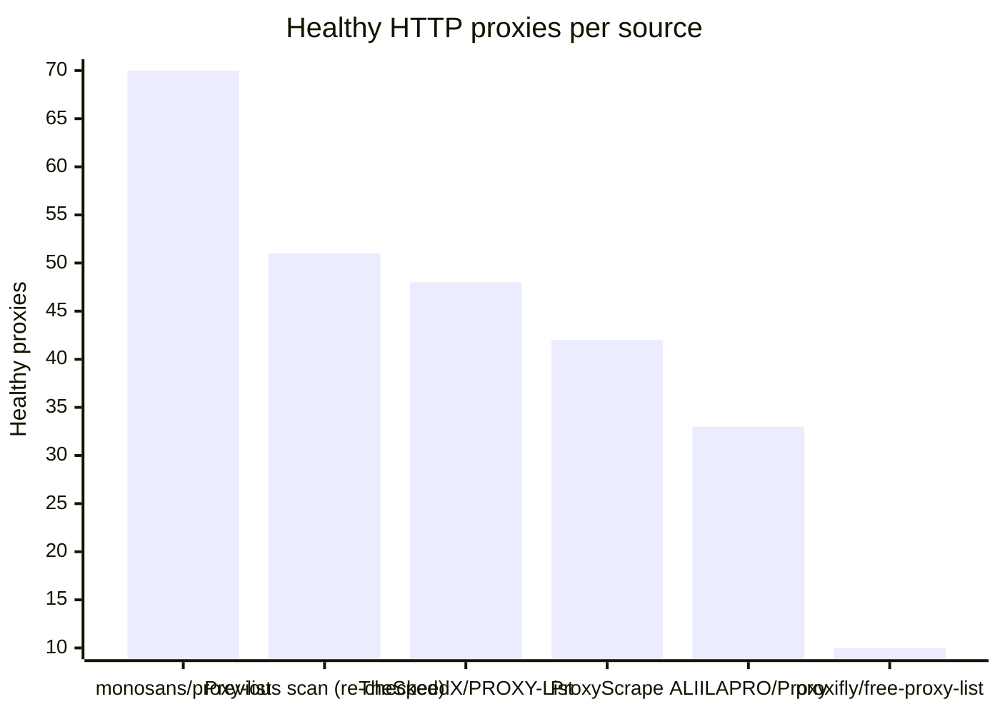
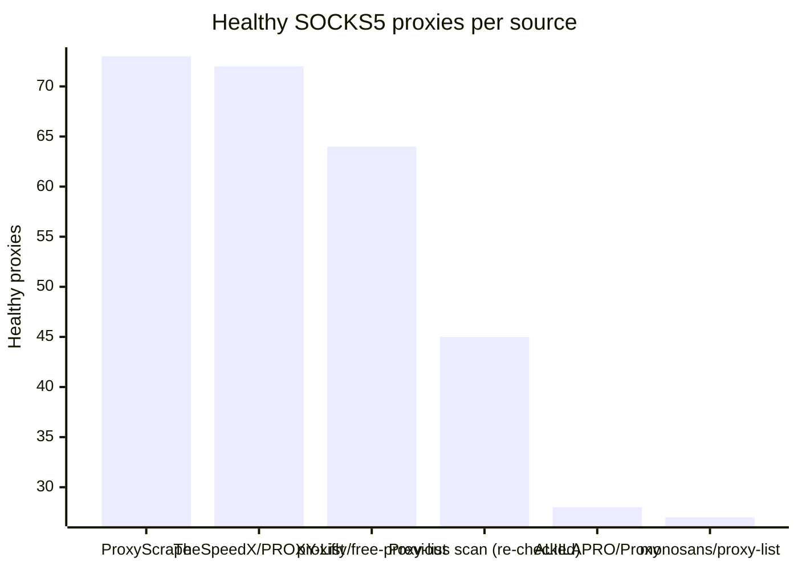

# Proxy Configs

<!-- dynamic timestamp placeholders for workflow sed script -->
channel_stats_chart.svg?v=1788674545
performance_report.html?v=1788674545

### Performance Chart

### Performance Report
[View Report](assets/performance_report.html?v=1788674545)

## HTTP

<!-- STATS:HTTP:START -->

_Last updated: 2026-09-06 00:06 UTC_

| Source | Healthy proxies |
|---|---|
| monosans/proxy-list | 70 |
| Previous scan (re-checked) | 51 |
| TheSpeedX/PROXY-List | 48 |
| ProxyScrape | 42 |
| ALIILAPRO/Proxy | 33 |
| proxifly/free-proxy-list | 10 |
| **Total unique** | **254** |

<!-- STATS:HTTP:END -->

## SOCKS5

<!-- STATS:SOCKS5:START -->

_Last updated: 2026-09-06 00:06 UTC_

| Source | Healthy proxies |
|---|---|
| ProxyScrape | 73 |
| TheSpeedX/PROXY-List | 72 |
| proxifly/free-proxy-list | 64 |
| Previous scan (re-checked) | 45 |
| ALIILAPRO/Proxy | 28 |
| monosans/proxy-list | 27 |
| **Total unique** | **309** |

<!-- STATS:SOCKS5:END -->
