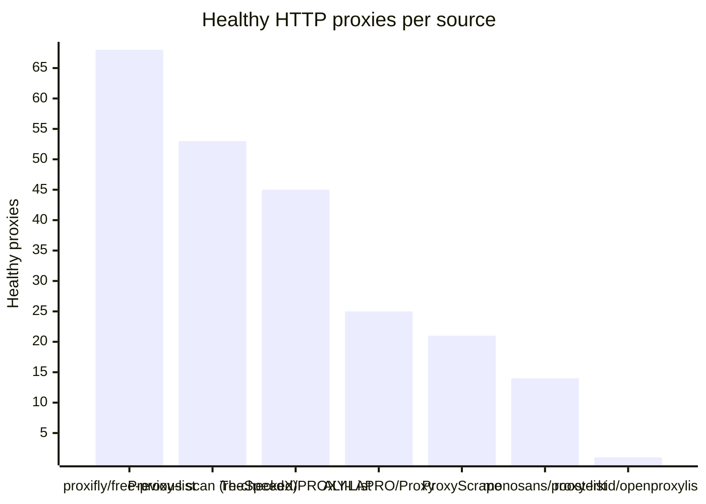
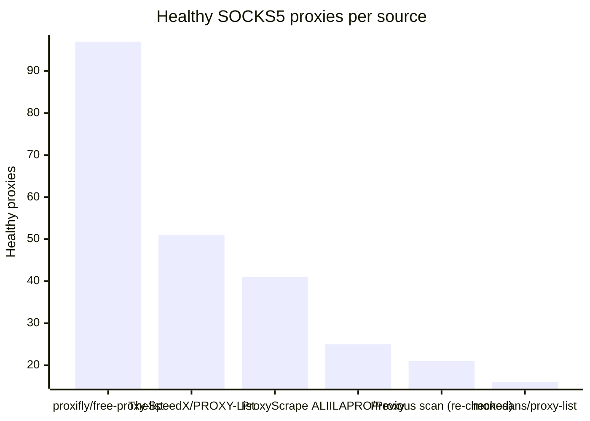

# Proxy Configs

<!-- dynamic timestamp placeholders for workflow sed script -->
channel_stats_chart.svg?v=1790445712
performance_report.html?v=1790445712

### Performance Chart

### Performance Report
[View Report](assets/performance_report.html?v=1790445712)

## HTTP

<!-- STATS:HTTP:START -->

_Last updated: 2026-09-26 12:18 UTC_

| Source | Healthy proxies |
|---|---|
| proxifly/free-proxy-list | 68 |
| Previous scan (re-checked) | 53 |
| TheSpeedX/PROXY-List | 45 |
| ALIILAPRO/Proxy | 25 |
| ProxyScrape | 21 |
| monosans/proxy-list | 14 |
| roosterkid/openproxylist | 1 |
| **Total unique** | **227** |

<!-- STATS:HTTP:END -->

## SOCKS5

<!-- STATS:SOCKS5:START -->

_Last updated: 2026-09-26 12:18 UTC_

| Source | Healthy proxies |
|---|---|
| proxifly/free-proxy-list | 97 |
| TheSpeedX/PROXY-List | 51 |
| ProxyScrape | 41 |
| ALIILAPRO/Proxy | 25 |
| Previous scan (re-checked) | 21 |
| monosans/proxy-list | 16 |
| **Total unique** | **251** |

<!-- STATS:SOCKS5:END -->
