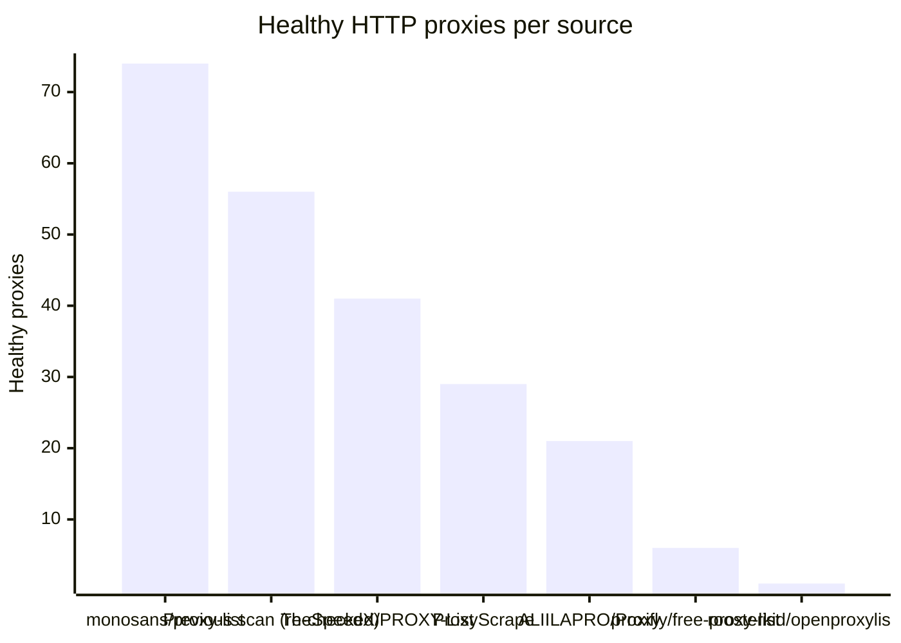
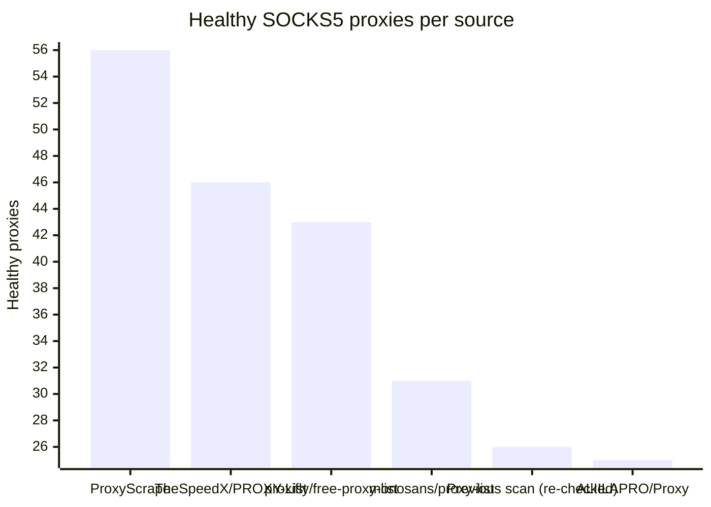

# Proxy Configs

<!-- dynamic timestamp placeholders for workflow sed script -->
channel_stats_chart.svg?v=1789192888
performance_report.html?v=1789192888

### Performance Chart

### Performance Report
[View Report](assets/performance_report.html?v=1789192888)

## HTTP

<!-- STATS:HTTP:START -->

_Last updated: 2026-09-12 00:07 UTC_

| Source | Healthy proxies |
|---|---|
| monosans/proxy-list | 74 |
| Previous scan (re-checked) | 56 |
| TheSpeedX/PROXY-List | 41 |
| ProxyScrape | 29 |
| ALIILAPRO/Proxy | 21 |
| proxifly/free-proxy-list | 6 |
| roosterkid/openproxylist | 1 |
| **Total unique** | **228** |

<!-- STATS:HTTP:END -->

## SOCKS5

<!-- STATS:SOCKS5:START -->

_Last updated: 2026-09-12 00:07 UTC_

| Source | Healthy proxies |
|---|---|
| ProxyScrape | 56 |
| TheSpeedX/PROXY-List | 46 |
| proxifly/free-proxy-list | 43 |
| monosans/proxy-list | 31 |
| Previous scan (re-checked) | 26 |
| ALIILAPRO/Proxy | 25 |
| **Total unique** | **227** |

<!-- STATS:SOCKS5:END -->
