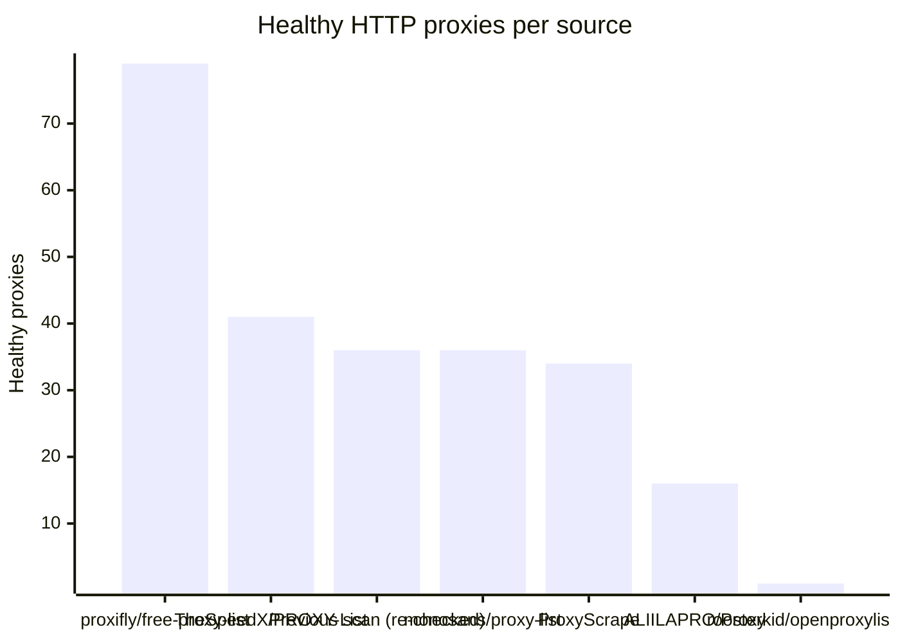
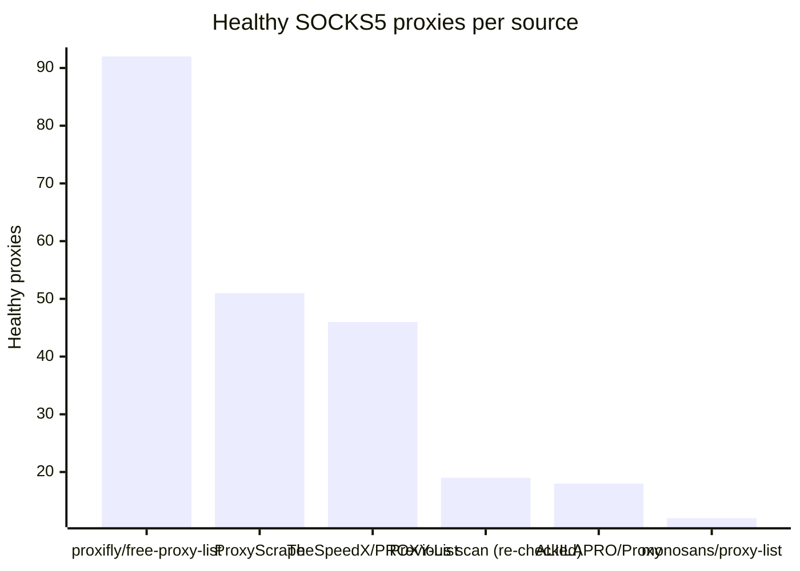

# Proxy Configs

<!-- dynamic timestamp placeholders for workflow sed script -->
channel_stats_chart.svg?v=1790294481
performance_report.html?v=1790294481

### Performance Chart

### Performance Report
[View Report](assets/performance_report.html?v=1790294481)

## HTTP

<!-- STATS:HTTP:START -->

_Last updated: 2026-09-24 18:15 UTC_

| Source | Healthy proxies |
|---|---|
| proxifly/free-proxy-list | 79 |
| TheSpeedX/PROXY-List | 41 |
| Previous scan (re-checked) | 36 |
| monosans/proxy-list | 36 |
| ProxyScrape | 34 |
| ALIILAPRO/Proxy | 16 |
| roosterkid/openproxylist | 1 |
| **Total unique** | **243** |

<!-- STATS:HTTP:END -->

## SOCKS5

<!-- STATS:SOCKS5:START -->

_Last updated: 2026-09-24 18:15 UTC_

| Source | Healthy proxies |
|---|---|
| proxifly/free-proxy-list | 92 |
| ProxyScrape | 51 |
| TheSpeedX/PROXY-List | 46 |
| Previous scan (re-checked) | 19 |
| ALIILAPRO/Proxy | 18 |
| monosans/proxy-list | 12 |
| **Total unique** | **238** |

<!-- STATS:SOCKS5:END -->
