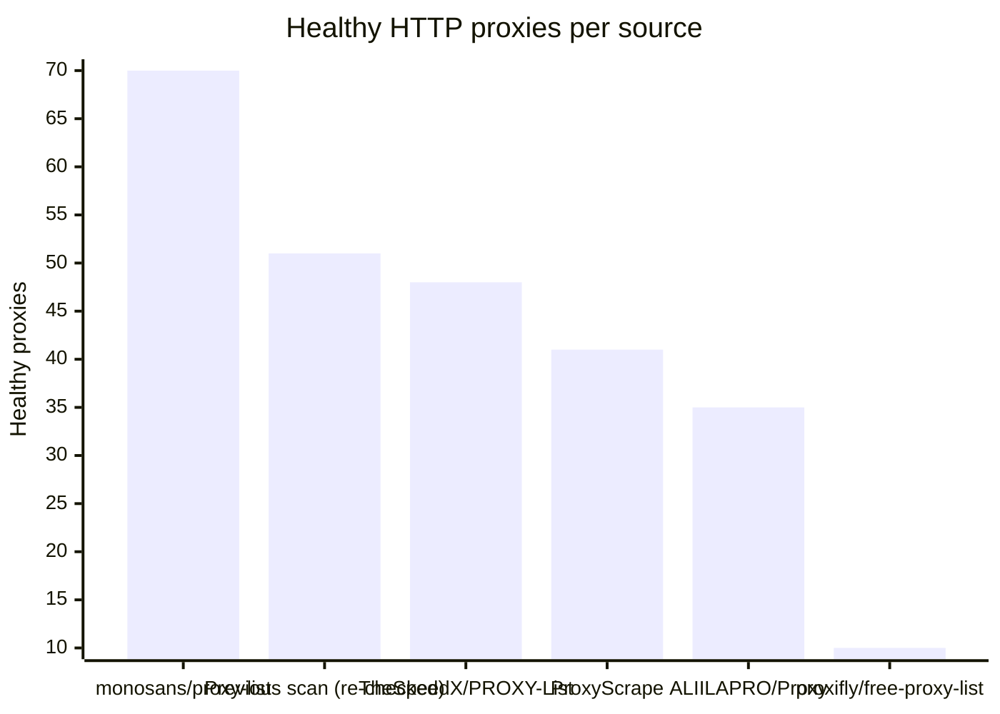
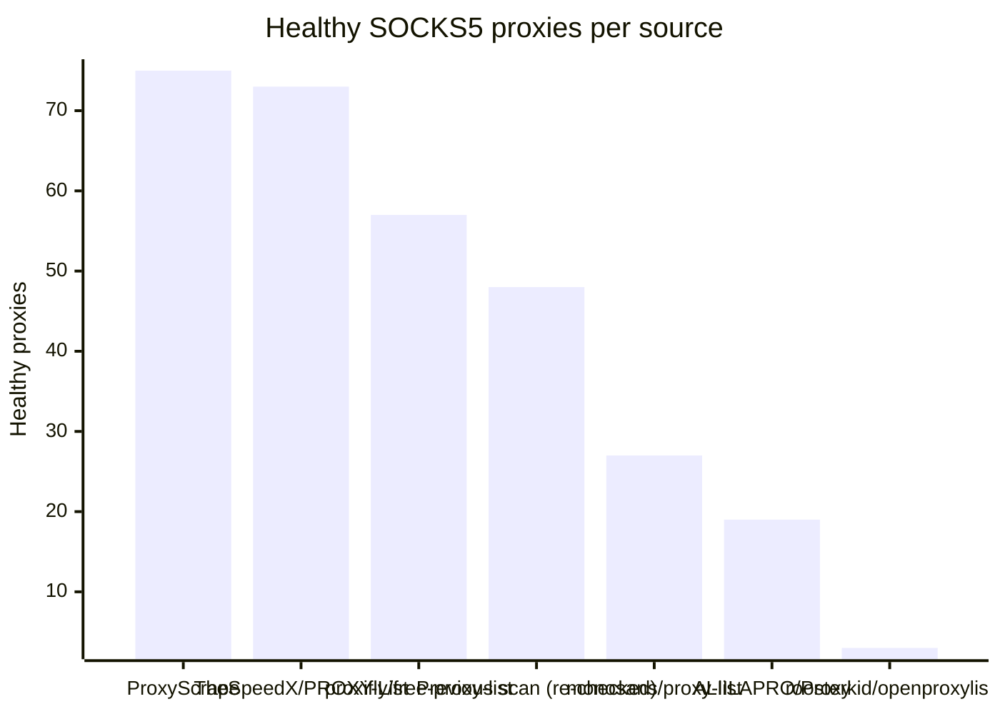

# Proxy Configs

<!-- dynamic timestamp placeholders for workflow sed script -->
channel_stats_chart.svg?v=1788030873
performance_report.html?v=1788030873

### Performance Chart

### Performance Report
[View Report](assets/performance_report.html?v=1788030873)

## HTTP

<!-- STATS:HTTP:START -->

_Last updated: 2026-09-07 06:07 UTC_

| Source | Healthy proxies |
|---|---|
| monosans/proxy-list | 70 |
| Previous scan (re-checked) | 51 |
| TheSpeedX/PROXY-List | 48 |
| ProxyScrape | 41 |
| ALIILAPRO/Proxy | 35 |
| proxifly/free-proxy-list | 10 |
| **Total unique** | **255** |

<!-- STATS:HTTP:END -->

## SOCKS5

<!-- STATS:SOCKS5:START -->

_Last updated: 2026-09-07 06:07 UTC_

| Source | Healthy proxies |
|---|---|
| ProxyScrape | 75 |
| TheSpeedX/PROXY-List | 73 |
| proxifly/free-proxy-list | 57 |
| Previous scan (re-checked) | 48 |
| monosans/proxy-list | 27 |
| ALIILAPRO/Proxy | 19 |
| roosterkid/openproxylist | 3 |
| **Total unique** | **302** |

<!-- STATS:SOCKS5:END -->
