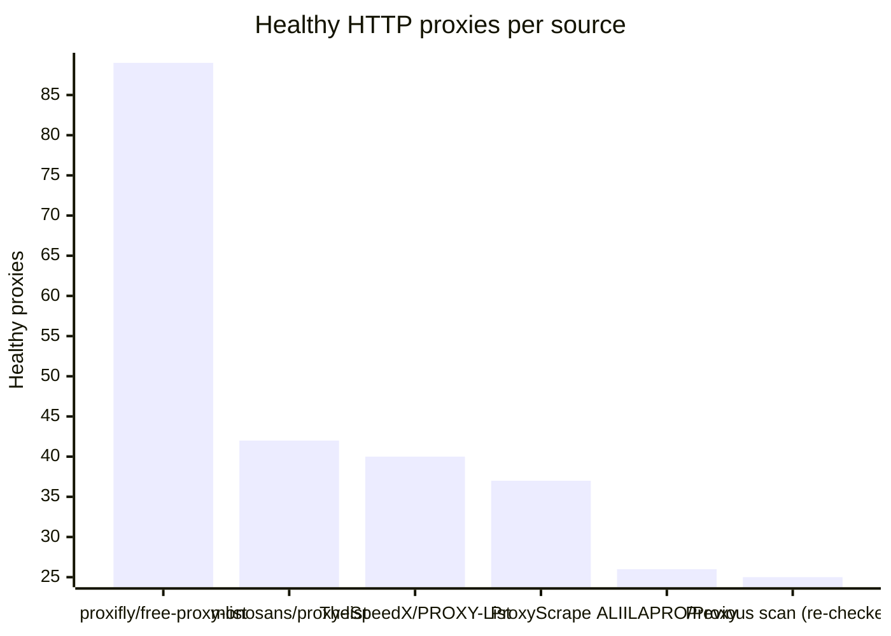
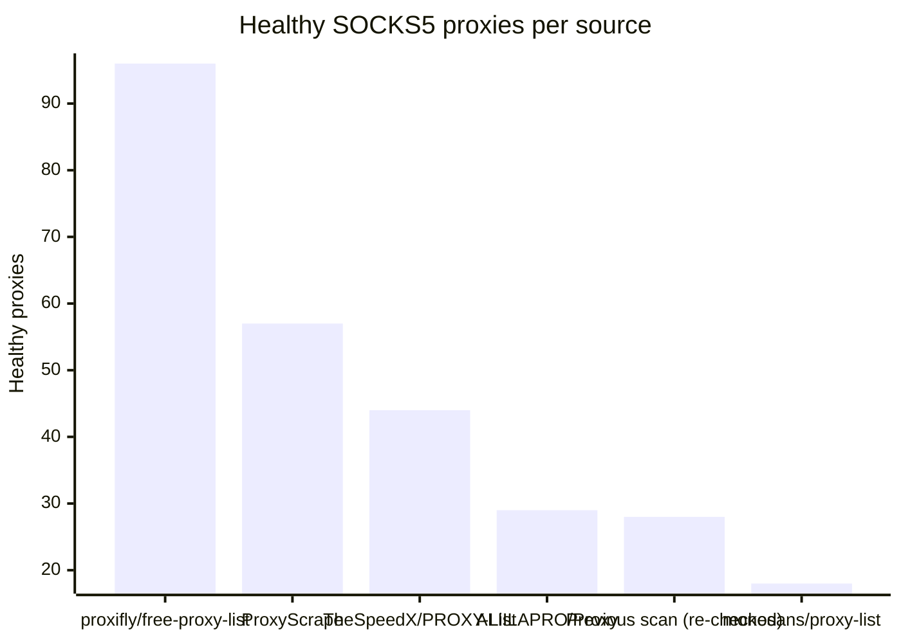

# Proxy Configs

<!-- dynamic timestamp placeholders for workflow sed script -->
channel_stats_chart.svg?v=1789819400
performance_report.html?v=1789819400

### Performance Chart

### Performance Report
[View Report](assets/performance_report.html?v=1789819400)

## HTTP

<!-- STATS:HTTP:START -->

_Last updated: 2026-09-19 06:15 UTC_

| Source | Healthy proxies |
|---|---|
| proxifly/free-proxy-list | 89 |
| monosans/proxy-list | 42 |
| TheSpeedX/PROXY-List | 40 |
| ProxyScrape | 37 |
| ALIILAPRO/Proxy | 26 |
| Previous scan (re-checked) | 25 |
| **Total unique** | **259** |

<!-- STATS:HTTP:END -->

## SOCKS5

<!-- STATS:SOCKS5:START -->

_Last updated: 2026-09-19 06:15 UTC_

| Source | Healthy proxies |
|---|---|
| proxifly/free-proxy-list | 96 |
| ProxyScrape | 57 |
| TheSpeedX/PROXY-List | 44 |
| ALIILAPRO/Proxy | 29 |
| Previous scan (re-checked) | 28 |
| monosans/proxy-list | 18 |
| **Total unique** | **272** |

<!-- STATS:SOCKS5:END -->
