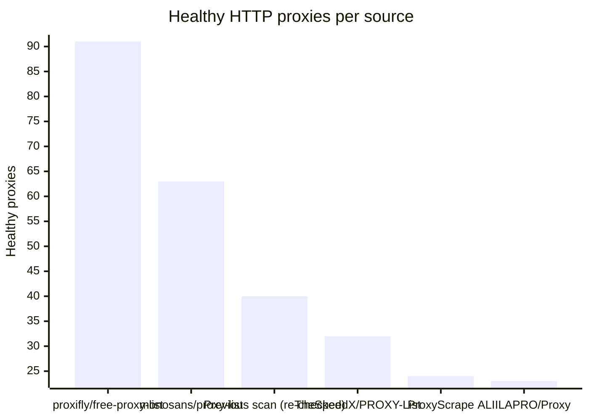
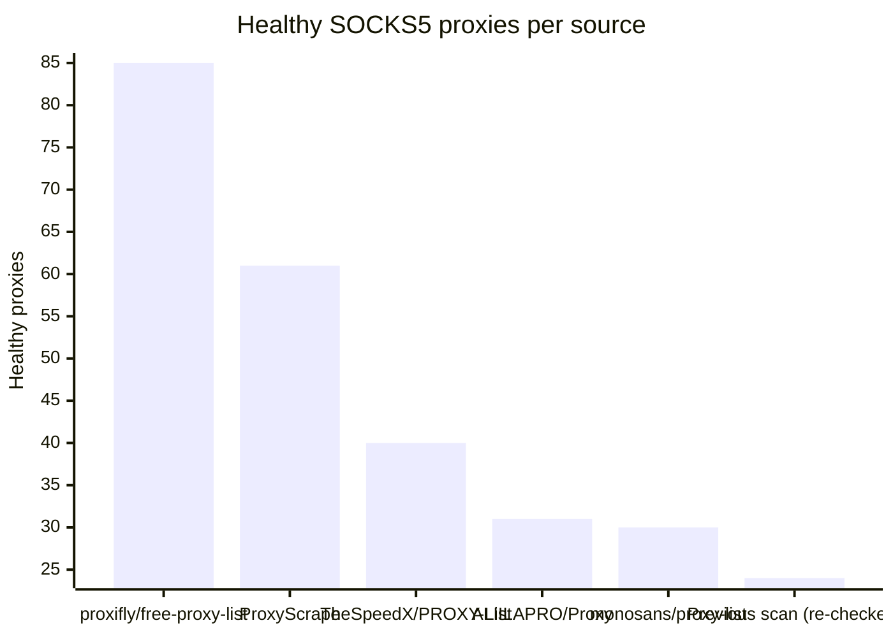

# Proxy Configs

<!-- dynamic timestamp placeholders for workflow sed script -->
channel_stats_chart.svg?v=1789452224
performance_report.html?v=1789452224

### Performance Chart

### Performance Report
[View Report](assets/performance_report.html?v=1789452224)

## HTTP

<!-- STATS:HTTP:START -->

_Last updated: 2026-09-15 00:10 UTC_

| Source | Healthy proxies |
|---|---|
| proxifly/free-proxy-list | 91 |
| monosans/proxy-list | 63 |
| Previous scan (re-checked) | 40 |
| TheSpeedX/PROXY-List | 32 |
| ProxyScrape | 24 |
| ALIILAPRO/Proxy | 23 |
| **Total unique** | **273** |

<!-- STATS:HTTP:END -->

## SOCKS5

<!-- STATS:SOCKS5:START -->

_Last updated: 2026-09-15 00:10 UTC_

| Source | Healthy proxies |
|---|---|
| proxifly/free-proxy-list | 85 |
| ProxyScrape | 61 |
| TheSpeedX/PROXY-List | 40 |
| ALIILAPRO/Proxy | 31 |
| monosans/proxy-list | 30 |
| Previous scan (re-checked) | 24 |
| **Total unique** | **271** |

<!-- STATS:SOCKS5:END -->
