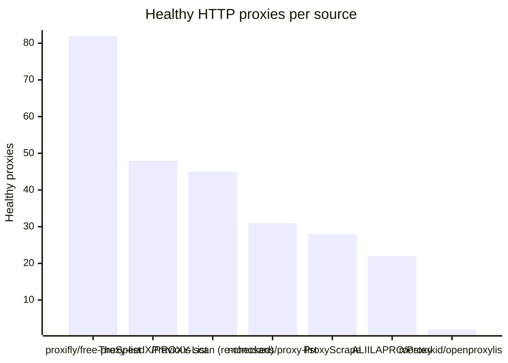
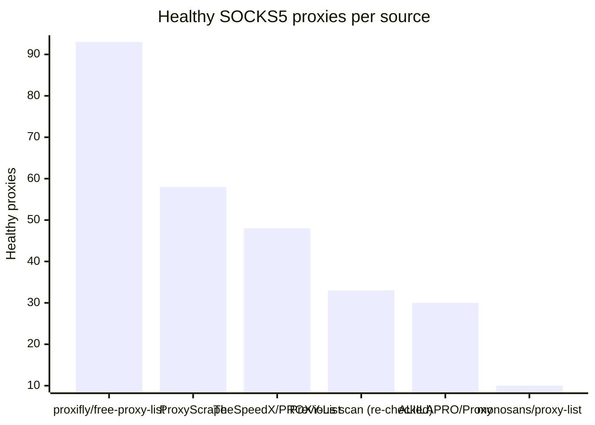

# Proxy Configs

<!-- dynamic timestamp placeholders for workflow sed script -->
channel_stats_chart.svg?v=1790121650
performance_report.html?v=1790121650

### Performance Chart

### Performance Report
[View Report](assets/performance_report.html?v=1790121650)

## HTTP

<!-- STATS:HTTP:START -->

_Last updated: 2026-09-22 18:13 UTC_

| Source | Healthy proxies |
|---|---|
| proxifly/free-proxy-list | 82 |
| TheSpeedX/PROXY-List | 48 |
| Previous scan (re-checked) | 45 |
| monosans/proxy-list | 31 |
| ProxyScrape | 28 |
| ALIILAPRO/Proxy | 22 |
| roosterkid/openproxylist | 2 |
| **Total unique** | **258** |

<!-- STATS:HTTP:END -->

## SOCKS5

<!-- STATS:SOCKS5:START -->

_Last updated: 2026-09-22 18:13 UTC_

| Source | Healthy proxies |
|---|---|
| proxifly/free-proxy-list | 93 |
| ProxyScrape | 58 |
| TheSpeedX/PROXY-List | 48 |
| Previous scan (re-checked) | 33 |
| ALIILAPRO/Proxy | 30 |
| monosans/proxy-list | 10 |
| **Total unique** | **272** |

<!-- STATS:SOCKS5:END -->
