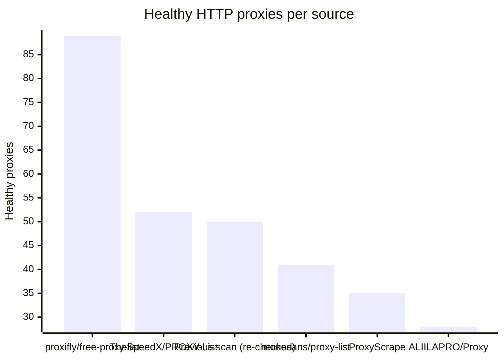
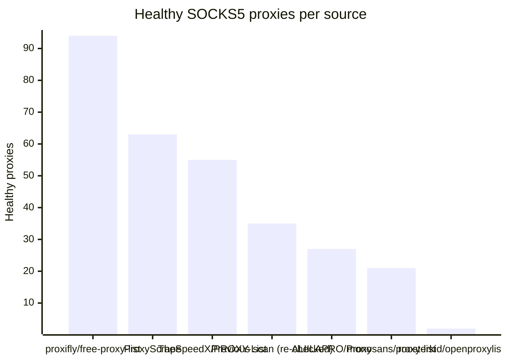

# Proxy Configs

<!-- dynamic timestamp placeholders for workflow sed script -->
channel_stats_chart.svg?v=1790337769
performance_report.html?v=1790337769

### Performance Chart

### Performance Report
[View Report](assets/performance_report.html?v=1790337769)

## HTTP

<!-- STATS:HTTP:START -->

_Last updated: 2026-09-25 06:15 UTC_

| Source | Healthy proxies |
|---|---|
| proxifly/free-proxy-list | 89 |
| TheSpeedX/PROXY-List | 52 |
| Previous scan (re-checked) | 50 |
| monosans/proxy-list | 41 |
| ProxyScrape | 35 |
| ALIILAPRO/Proxy | 28 |
| **Total unique** | **295** |

<!-- STATS:HTTP:END -->

## SOCKS5

<!-- STATS:SOCKS5:START -->

_Last updated: 2026-09-25 06:15 UTC_

| Source | Healthy proxies |
|---|---|
| proxifly/free-proxy-list | 94 |
| ProxyScrape | 63 |
| TheSpeedX/PROXY-List | 55 |
| Previous scan (re-checked) | 35 |
| ALIILAPRO/Proxy | 27 |
| monosans/proxy-list | 21 |
| roosterkid/openproxylist | 2 |
| **Total unique** | **297** |

<!-- STATS:SOCKS5:END -->
