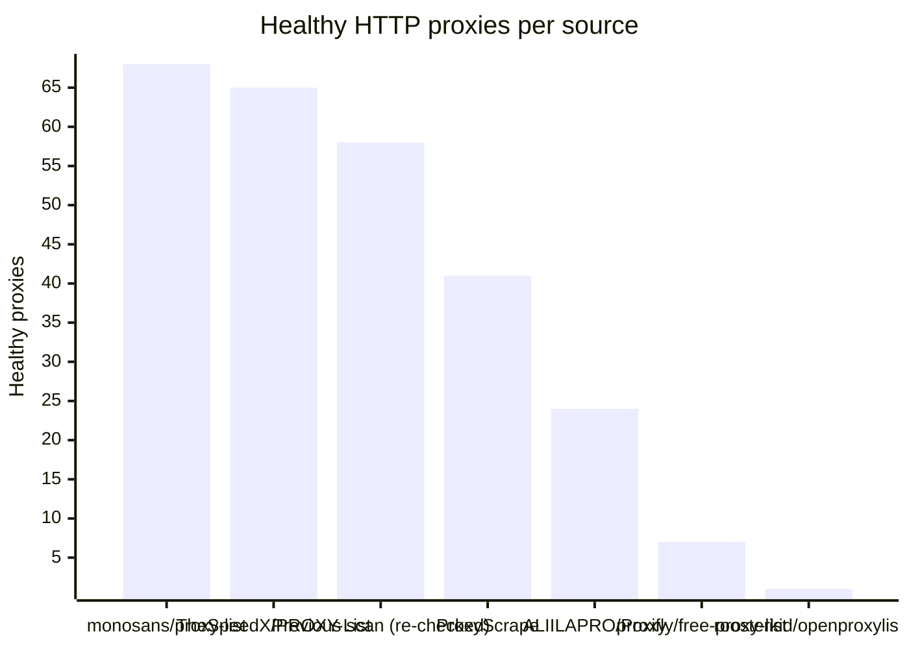
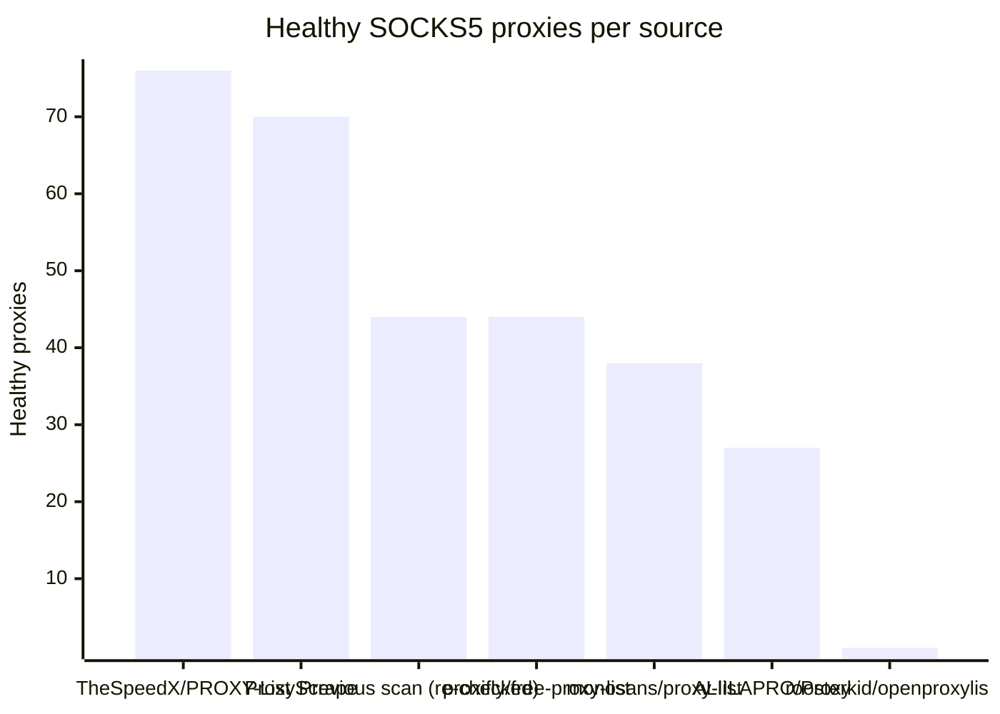

# Proxy Configs

<!-- dynamic timestamp placeholders for workflow sed script -->
channel_stats_chart.svg?v=1788544915
performance_report.html?v=1788544915

### Performance Chart

### Performance Report
[View Report](assets/performance_report.html?v=1788544915)

## HTTP

<!-- STATS:HTTP:START -->

_Last updated: 2026-09-04 12:09 UTC_

| Source | Healthy proxies |
|---|---|
| monosans/proxy-list | 68 |
| TheSpeedX/PROXY-List | 65 |
| Previous scan (re-checked) | 58 |
| ProxyScrape | 41 |
| ALIILAPRO/Proxy | 24 |
| proxifly/free-proxy-list | 7 |
| roosterkid/openproxylist | 1 |
| **Total unique** | **264** |

<!-- STATS:HTTP:END -->

## SOCKS5

<!-- STATS:SOCKS5:START -->

_Last updated: 2026-09-04 12:09 UTC_

| Source | Healthy proxies |
|---|---|
| TheSpeedX/PROXY-List | 76 |
| ProxyScrape | 70 |
| Previous scan (re-checked) | 44 |
| proxifly/free-proxy-list | 44 |
| monosans/proxy-list | 38 |
| ALIILAPRO/Proxy | 27 |
| roosterkid/openproxylist | 1 |
| **Total unique** | **300** |

<!-- STATS:SOCKS5:END -->
