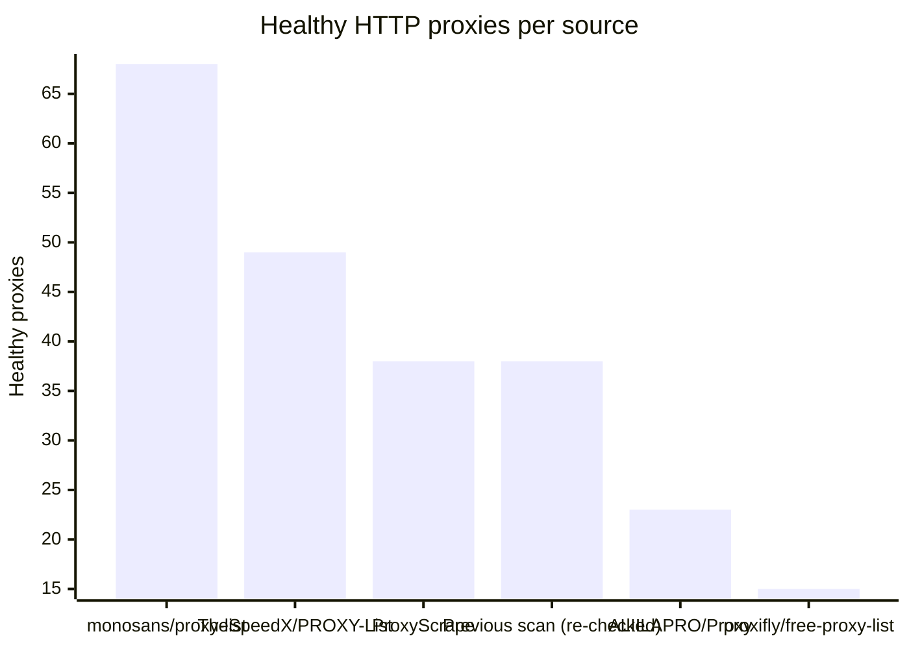
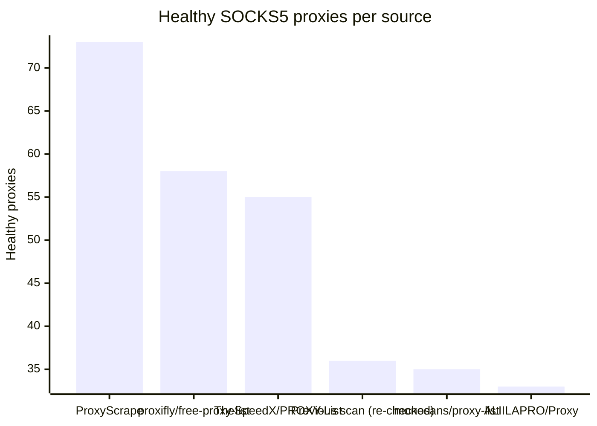

# Proxy Configs

<!-- dynamic timestamp placeholders for workflow sed script -->
channel_stats_chart.svg?v=1788350523
performance_report.html?v=1788350523

### Performance Chart

### Performance Report
[View Report](assets/performance_report.html?v=1788350523)

## HTTP

<!-- STATS:HTTP:START -->

_Last updated: 2026-09-02 06:07 UTC_

| Source | Healthy proxies |
|---|---|
| monosans/proxy-list | 68 |
| TheSpeedX/PROXY-List | 49 |
| ProxyScrape | 38 |
| Previous scan (re-checked) | 38 |
| ALIILAPRO/Proxy | 23 |
| proxifly/free-proxy-list | 15 |
| **Total unique** | **231** |

<!-- STATS:HTTP:END -->

## SOCKS5

<!-- STATS:SOCKS5:START -->

_Last updated: 2026-09-02 06:07 UTC_

| Source | Healthy proxies |
|---|---|
| ProxyScrape | 73 |
| proxifly/free-proxy-list | 58 |
| TheSpeedX/PROXY-List | 55 |
| Previous scan (re-checked) | 36 |
| monosans/proxy-list | 35 |
| ALIILAPRO/Proxy | 33 |
| **Total unique** | **290** |

<!-- STATS:SOCKS5:END -->
