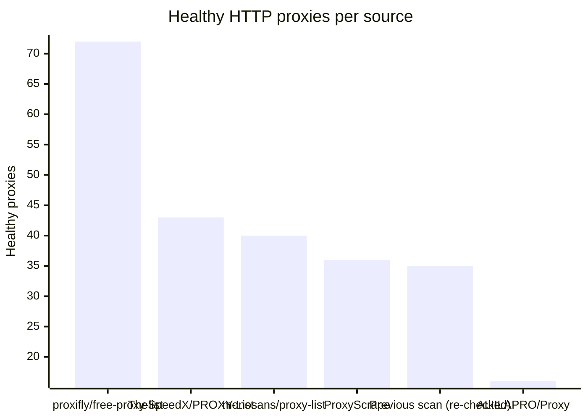
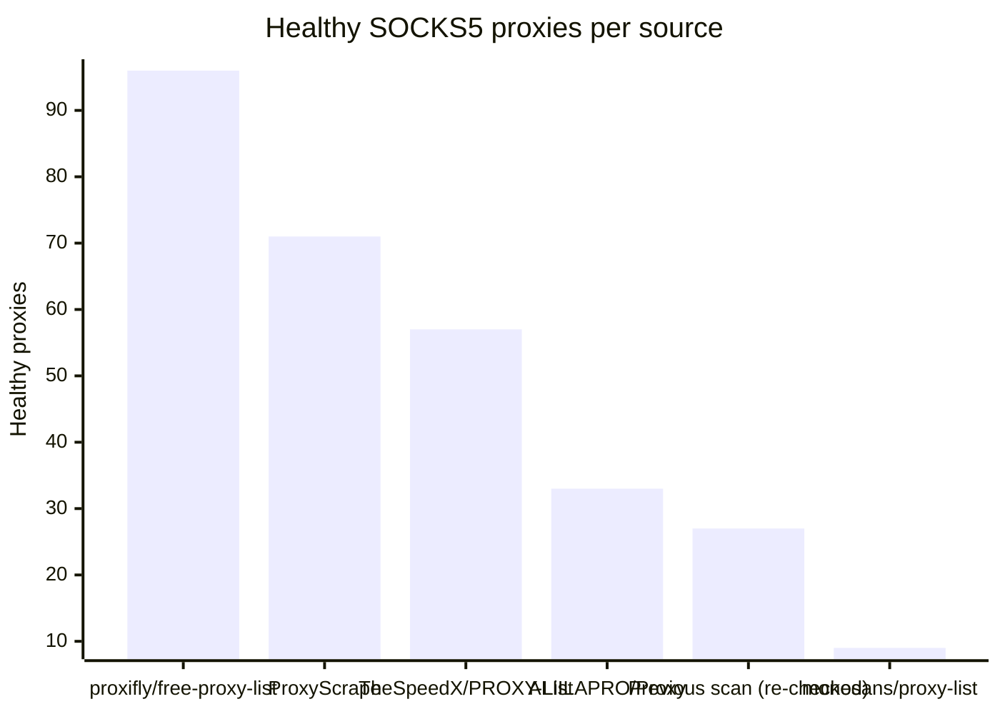

# Proxy Configs

<!-- dynamic timestamp placeholders for workflow sed script -->
channel_stats_chart.svg?v=1789797923
performance_report.html?v=1789797923

### Performance Chart

### Performance Report
[View Report](assets/performance_report.html?v=1789797923)

## HTTP

<!-- STATS:HTTP:START -->

_Last updated: 2026-09-19 00:15 UTC_

| Source | Healthy proxies |
|---|---|
| proxifly/free-proxy-list | 72 |
| TheSpeedX/PROXY-List | 43 |
| monosans/proxy-list | 40 |
| ProxyScrape | 36 |
| Previous scan (re-checked) | 35 |
| ALIILAPRO/Proxy | 16 |
| **Total unique** | **242** |

<!-- STATS:HTTP:END -->

## SOCKS5

<!-- STATS:SOCKS5:START -->

_Last updated: 2026-09-19 00:15 UTC_

| Source | Healthy proxies |
|---|---|
| proxifly/free-proxy-list | 96 |
| ProxyScrape | 71 |
| TheSpeedX/PROXY-List | 57 |
| ALIILAPRO/Proxy | 33 |
| Previous scan (re-checked) | 27 |
| monosans/proxy-list | 9 |
| **Total unique** | **293** |

<!-- STATS:SOCKS5:END -->
