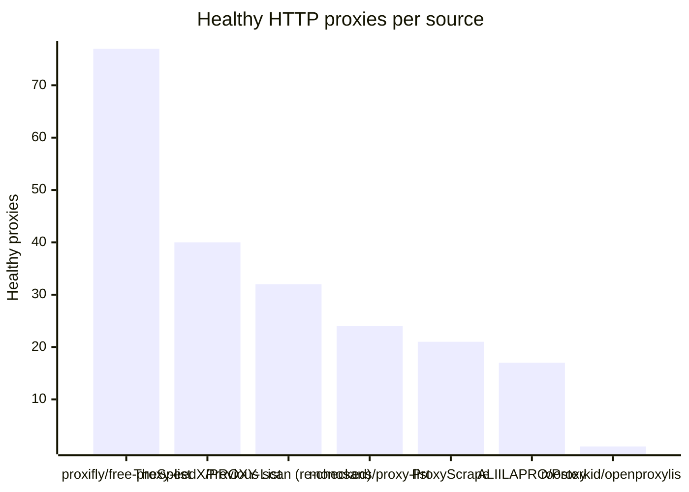

# Proxy Configs

<!-- dynamic timestamp placeholders for workflow sed script -->
channel_stats_chart.svg?v=1790013767
performance_report.html?v=1790013767

### Performance Chart

### Performance Report
[View Report](assets/performance_report.html?v=1790013767)

## HTTP

<!-- STATS:HTTP:START -->

_Last updated: 2026-09-21 12:16 UTC_

| Source | Healthy proxies |
|---|---|
| proxifly/free-proxy-list | 77 |
| TheSpeedX/PROXY-List | 40 |
| Previous scan (re-checked) | 32 |
| monosans/proxy-list | 24 |
| ProxyScrape | 21 |
| ALIILAPRO/Proxy | 17 |
| roosterkid/openproxylist | 1 |
| **Total unique** | **212** |

<!-- STATS:HTTP:END -->

## SOCKS5

<!-- STATS:SOCKS5:START -->

_Last updated: 2026-09-21 12:16 UTC_

| Source | Healthy proxies |
|---|---|
| proxifly/free-proxy-list | 90 |
| ProxyScrape | 62 |
| TheSpeedX/PROXY-List | 60 |
| Previous scan (re-checked) | 38 |
| ALIILAPRO/Proxy | 29 |
| monosans/proxy-list | 16 |
| **Total unique** | **295** |

<!-- STATS:SOCKS5:END -->
