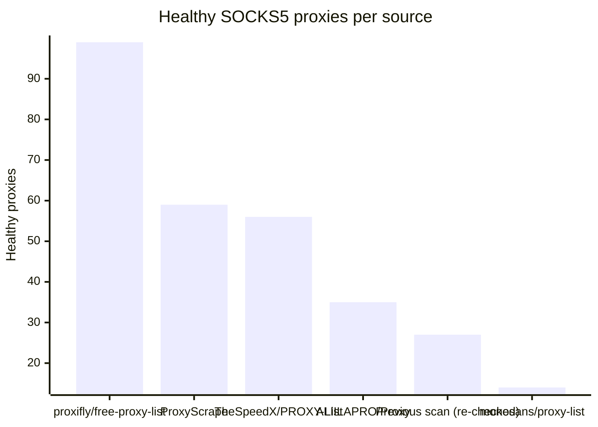

# Proxy Configs

<!-- dynamic timestamp placeholders for workflow sed script -->
channel_stats_chart.svg?v=1789884096
performance_report.html?v=1789884096

### Performance Chart

### Performance Report
[View Report](assets/performance_report.html?v=1789884096)

## HTTP

<!-- STATS:HTTP:START -->

_Last updated: 2026-09-20 00:17 UTC_

| Source | Healthy proxies |
|---|---|
| proxifly/free-proxy-list | 83 |
| Previous scan (re-checked) | 44 |
| monosans/proxy-list | 41 |
| TheSpeedX/PROXY-List | 39 |
| ProxyScrape | 27 |
| ALIILAPRO/Proxy | 16 |
| **Total unique** | **250** |

<!-- STATS:HTTP:END -->

## SOCKS5

<!-- STATS:SOCKS5:START -->

_Last updated: 2026-09-20 00:17 UTC_

| Source | Healthy proxies |
|---|---|
| proxifly/free-proxy-list | 99 |
| ProxyScrape | 59 |
| TheSpeedX/PROXY-List | 56 |
| ALIILAPRO/Proxy | 35 |
| Previous scan (re-checked) | 27 |
| monosans/proxy-list | 14 |
| **Total unique** | **290** |

<!-- STATS:SOCKS5:END -->
