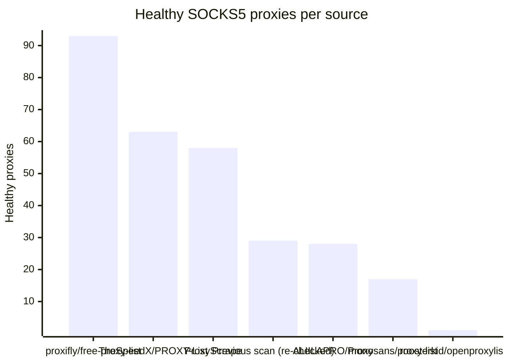

# Proxy Configs

<!-- dynamic timestamp placeholders for workflow sed script -->
channel_stats_chart.svg?v=1790359358
performance_report.html?v=1790359358

### Performance Chart

### Performance Report
[View Report](assets/performance_report.html?v=1790359358)

## HTTP

<!-- STATS:HTTP:START -->

_Last updated: 2026-09-25 12:17 UTC_

| Source | Healthy proxies |
|---|---|
| proxifly/free-proxy-list | 86 |
| Previous scan (re-checked) | 44 |
| TheSpeedX/PROXY-List | 40 |
| monosans/proxy-list | 35 |
| ProxyScrape | 22 |
| ALIILAPRO/Proxy | 12 |
| **Total unique** | **239** |

<!-- STATS:HTTP:END -->

## SOCKS5

<!-- STATS:SOCKS5:START -->

_Last updated: 2026-09-25 12:17 UTC_

| Source | Healthy proxies |
|---|---|
| proxifly/free-proxy-list | 93 |
| TheSpeedX/PROXY-List | 63 |
| ProxyScrape | 58 |
| Previous scan (re-checked) | 29 |
| ALIILAPRO/Proxy | 28 |
| monosans/proxy-list | 17 |
| roosterkid/openproxylist | 1 |
| **Total unique** | **289** |

<!-- STATS:SOCKS5:END -->
