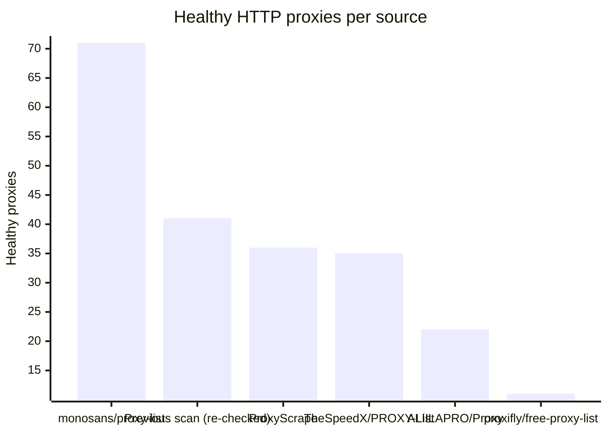
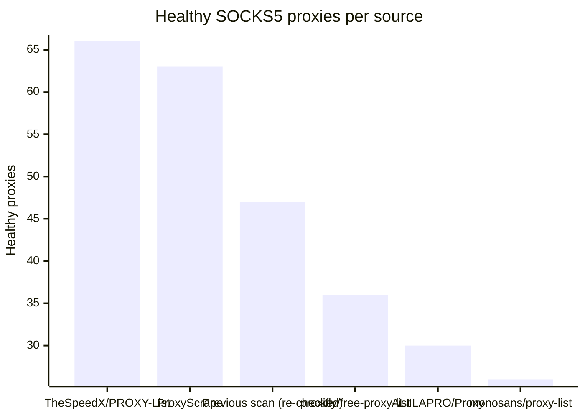

# Proxy Configs

<!-- dynamic timestamp placeholders for workflow sed script -->
channel_stats_chart.svg?v=1788039210
performance_report.html?v=1788039210

### Performance Chart

### Performance Report
[View Report](assets/performance_report.html?v=1788039210)

## HTTP

<!-- STATS:HTTP:START -->

_Last updated: 2026-08-29 21:14 UTC_

| Source | Healthy proxies |
|---|---|
| monosans/proxy-list | 71 |
| Previous scan (re-checked) | 41 |
| ProxyScrape | 36 |
| TheSpeedX/PROXY-List | 35 |
| ALIILAPRO/Proxy | 22 |
| proxifly/free-proxy-list | 11 |
| **Total unique** | **216** |

<!-- STATS:HTTP:END -->

## SOCKS5

<!-- STATS:SOCKS5:START -->

_Last updated: 2026-08-29 21:14 UTC_

| Source | Healthy proxies |
|---|---|
| TheSpeedX/PROXY-List | 66 |
| ProxyScrape | 63 |
| Previous scan (re-checked) | 47 |
| proxifly/free-proxy-list | 36 |
| ALIILAPRO/Proxy | 30 |
| monosans/proxy-list | 26 |
| **Total unique** | **268** |

<!-- STATS:SOCKS5:END -->
