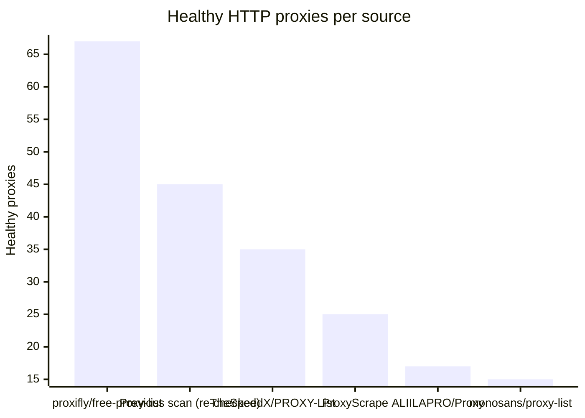
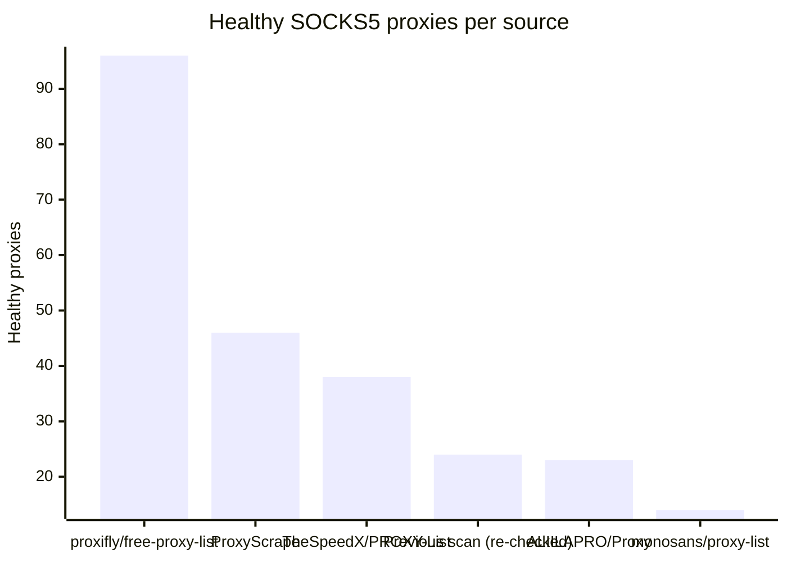

# Proxy Configs

<!-- dynamic timestamp placeholders for workflow sed script -->
channel_stats_chart.svg?v=1788030873
performance_report.html?v=1788030873

### Performance Chart

### Performance Report
[View Report](assets/performance_report.html?v=1788030873)

## HTTP

<!-- STATS:HTTP:START -->

_Last updated: 2026-09-26 06:16 UTC_

| Source | Healthy proxies |
|---|---|
| proxifly/free-proxy-list | 67 |
| Previous scan (re-checked) | 45 |
| TheSpeedX/PROXY-List | 35 |
| ProxyScrape | 25 |
| ALIILAPRO/Proxy | 17 |
| monosans/proxy-list | 15 |
| **Total unique** | **204** |

<!-- STATS:HTTP:END -->

## SOCKS5

<!-- STATS:SOCKS5:START -->

_Last updated: 2026-09-26 06:16 UTC_

| Source | Healthy proxies |
|---|---|
| proxifly/free-proxy-list | 96 |
| ProxyScrape | 46 |
| TheSpeedX/PROXY-List | 38 |
| Previous scan (re-checked) | 24 |
| ALIILAPRO/Proxy | 23 |
| monosans/proxy-list | 14 |
| **Total unique** | **241** |

<!-- STATS:SOCKS5:END -->
