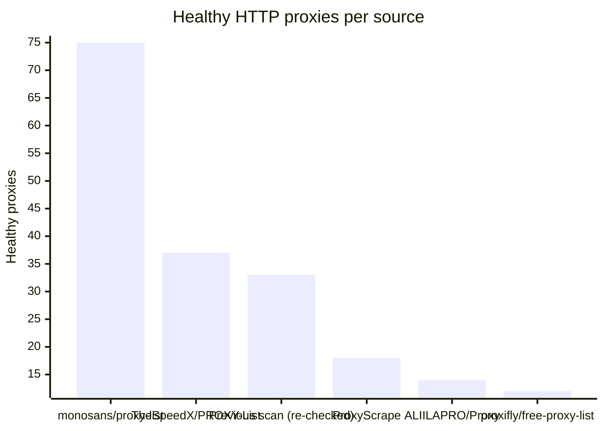
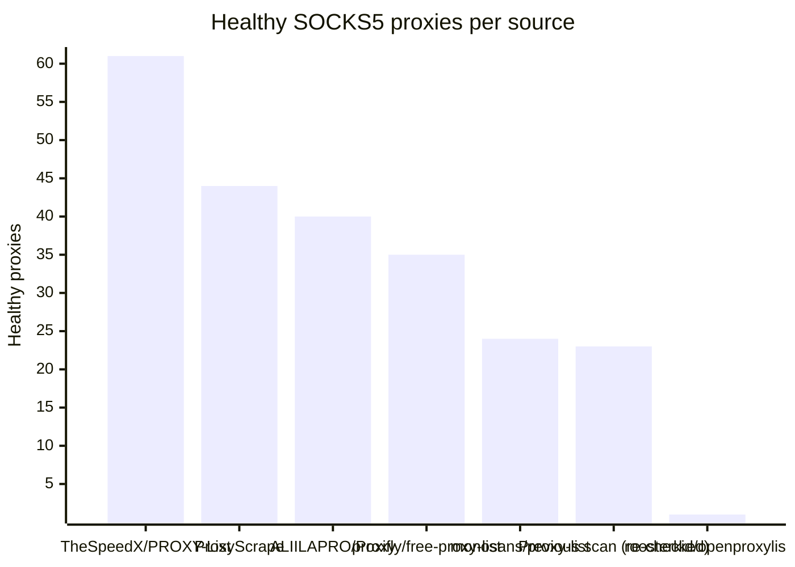

# Proxy Configs

<!-- dynamic timestamp placeholders for workflow sed script -->
channel_stats_chart.svg?v=1789365677
performance_report.html?v=1789365677

### Performance Chart

### Performance Report
[View Report](assets/performance_report.html?v=1789365677)

## HTTP

<!-- STATS:HTTP:START -->

_Last updated: 2026-09-14 00:08 UTC_

| Source | Healthy proxies |
|---|---|
| monosans/proxy-list | 75 |
| TheSpeedX/PROXY-List | 37 |
| Previous scan (re-checked) | 33 |
| ProxyScrape | 18 |
| ALIILAPRO/Proxy | 14 |
| proxifly/free-proxy-list | 12 |
| **Total unique** | **189** |

<!-- STATS:HTTP:END -->

## SOCKS5

<!-- STATS:SOCKS5:START -->

_Last updated: 2026-09-14 00:08 UTC_

| Source | Healthy proxies |
|---|---|
| TheSpeedX/PROXY-List | 61 |
| ProxyScrape | 44 |
| ALIILAPRO/Proxy | 40 |
| proxifly/free-proxy-list | 35 |
| monosans/proxy-list | 24 |
| Previous scan (re-checked) | 23 |
| roosterkid/openproxylist | 1 |
| **Total unique** | **228** |

<!-- STATS:SOCKS5:END -->
