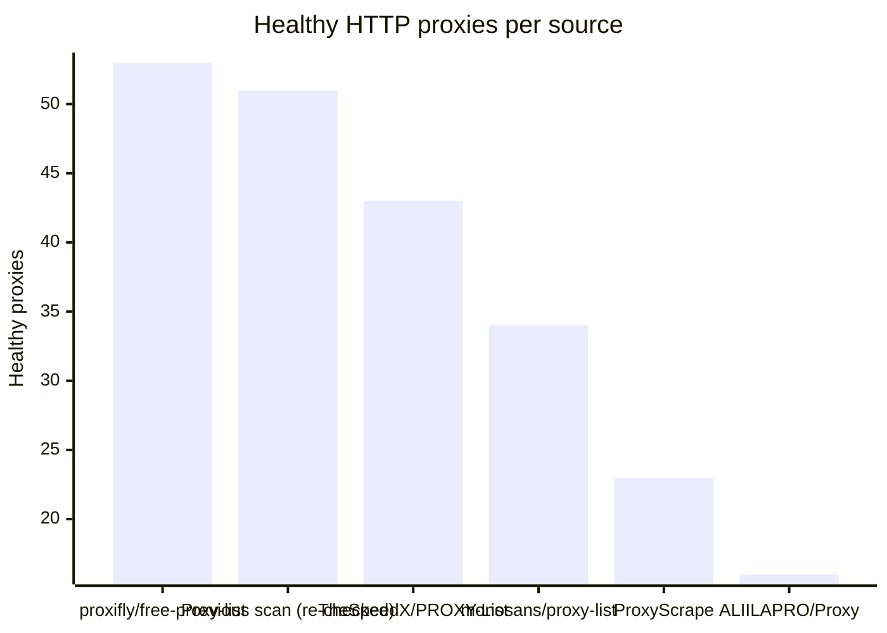

# Proxy Configs

<!-- dynamic timestamp placeholders for workflow sed script -->
channel_stats_chart.svg?v=1790229760
performance_report.html?v=1790229760

### Performance Chart

### Performance Report
[View Report](assets/performance_report.html?v=1790229760)

## HTTP

<!-- STATS:HTTP:START -->

_Last updated: 2026-09-24 00:15 UTC_

| Source | Healthy proxies |
|---|---|
| proxifly/free-proxy-list | 53 |
| Previous scan (re-checked) | 51 |
| TheSpeedX/PROXY-List | 43 |
| monosans/proxy-list | 34 |
| ProxyScrape | 23 |
| ALIILAPRO/Proxy | 16 |
| **Total unique** | **220** |

<!-- STATS:HTTP:END -->

## SOCKS5

<!-- STATS:SOCKS5:START -->

_Last updated: 2026-09-24 00:15 UTC_

| Source | Healthy proxies |
|---|---|
| proxifly/free-proxy-list | 90 |
| TheSpeedX/PROXY-List | 62 |
| ProxyScrape | 58 |
| Previous scan (re-checked) | 36 |
| ALIILAPRO/Proxy | 30 |
| monosans/proxy-list | 16 |
| **Total unique** | **292** |

<!-- STATS:SOCKS5:END -->
