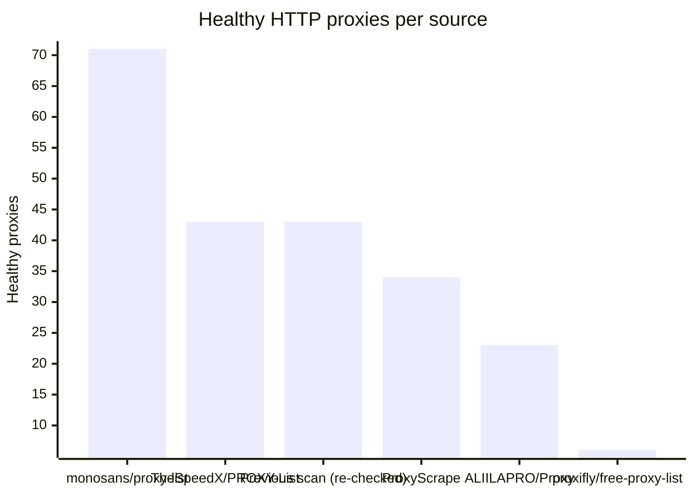
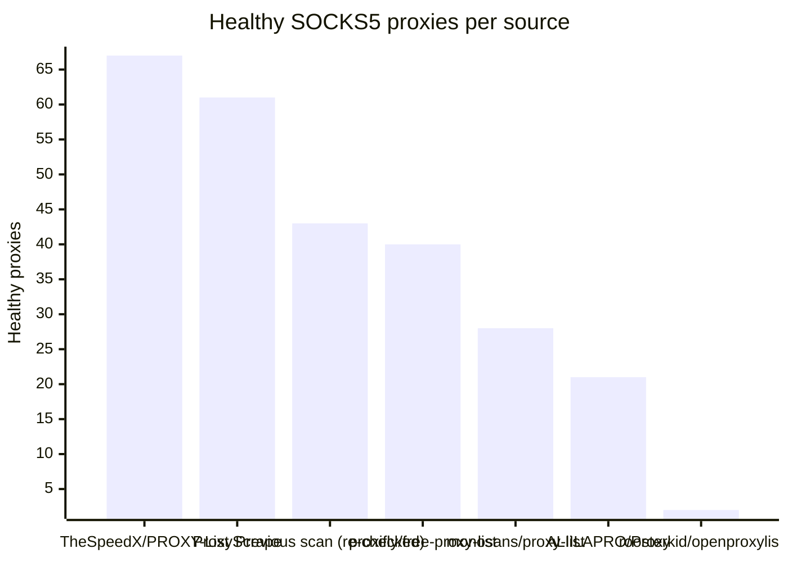

# Proxy Configs

<!-- dynamic timestamp placeholders for workflow sed script -->
channel_stats_chart.svg?v=1788393730
performance_report.html?v=1788393730

### Performance Chart

### Performance Report
[View Report](assets/performance_report.html?v=1788393730)

## HTTP

<!-- STATS:HTTP:START -->

_Last updated: 2026-09-02 18:08 UTC_

| Source | Healthy proxies |
|---|---|
| monosans/proxy-list | 71 |
| TheSpeedX/PROXY-List | 43 |
| Previous scan (re-checked) | 43 |
| ProxyScrape | 34 |
| ALIILAPRO/Proxy | 23 |
| proxifly/free-proxy-list | 6 |
| **Total unique** | **220** |

<!-- STATS:HTTP:END -->

## SOCKS5

<!-- STATS:SOCKS5:START -->

_Last updated: 2026-09-02 18:08 UTC_

| Source | Healthy proxies |
|---|---|
| TheSpeedX/PROXY-List | 67 |
| ProxyScrape | 61 |
| Previous scan (re-checked) | 43 |
| proxifly/free-proxy-list | 40 |
| monosans/proxy-list | 28 |
| ALIILAPRO/Proxy | 21 |
| roosterkid/openproxylist | 2 |
| **Total unique** | **262** |

<!-- STATS:SOCKS5:END -->
