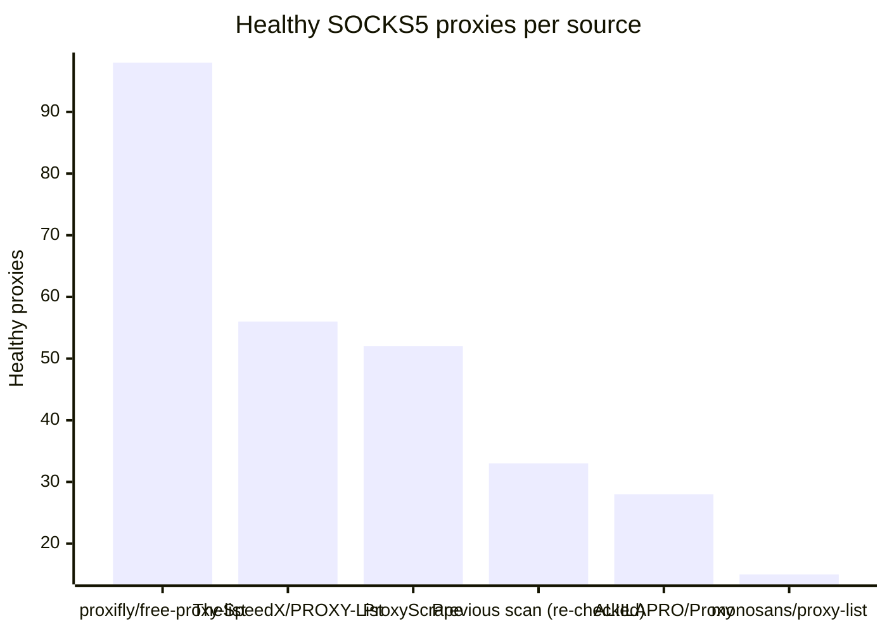

# Proxy Configs

<!-- dynamic timestamp placeholders for workflow sed script -->
channel_stats_chart.svg?v=1789711343
performance_report.html?v=1789711343

### Performance Chart

### Performance Report
[View Report](assets/performance_report.html?v=1789711343)

## HTTP

<!-- STATS:HTTP:START -->

_Last updated: 2026-09-18 00:16 UTC_

| Source | Healthy proxies |
|---|---|
| proxifly/free-proxy-list | 75 |
| Previous scan (re-checked) | 48 |
| TheSpeedX/PROXY-List | 46 |
| ProxyScrape | 32 |
| monosans/proxy-list | 31 |
| ALIILAPRO/Proxy | 21 |
| **Total unique** | **253** |

<!-- STATS:HTTP:END -->

## SOCKS5

<!-- STATS:SOCKS5:START -->

_Last updated: 2026-09-18 00:16 UTC_

| Source | Healthy proxies |
|---|---|
| proxifly/free-proxy-list | 98 |
| TheSpeedX/PROXY-List | 56 |
| ProxyScrape | 52 |
| Previous scan (re-checked) | 33 |
| ALIILAPRO/Proxy | 28 |
| monosans/proxy-list | 15 |
| **Total unique** | **282** |

<!-- STATS:SOCKS5:END -->
