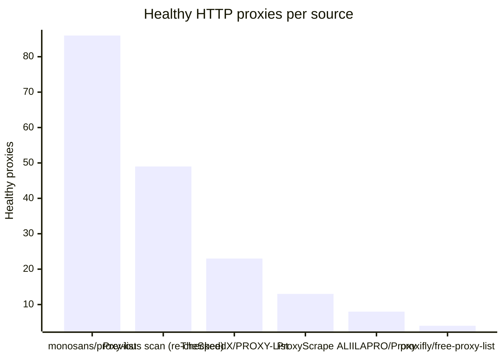
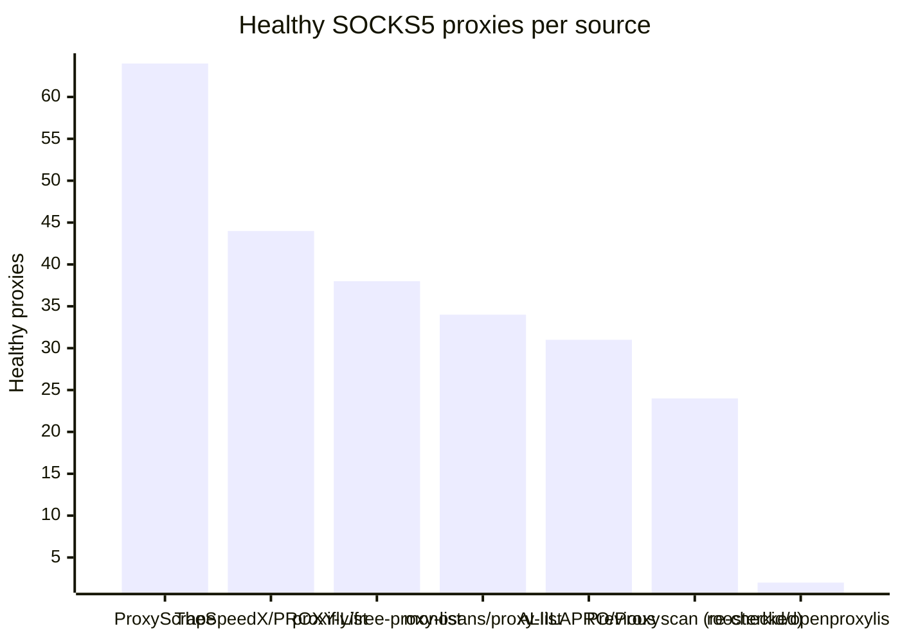

# Proxy Configs

<!-- dynamic timestamp placeholders for workflow sed script -->
channel_stats_chart.svg?v=1789387362
performance_report.html?v=1789387362

### Performance Chart

### Performance Report
[View Report](assets/performance_report.html?v=1789387362)

## HTTP

<!-- STATS:HTTP:START -->

_Last updated: 2026-09-14 06:06 UTC_

| Source | Healthy proxies |
|---|---|
| monosans/proxy-list | 86 |
| Previous scan (re-checked) | 49 |
| TheSpeedX/PROXY-List | 23 |
| ProxyScrape | 13 |
| ALIILAPRO/Proxy | 8 |
| proxifly/free-proxy-list | 4 |
| **Total unique** | **183** |

<!-- STATS:HTTP:END -->

## SOCKS5

<!-- STATS:SOCKS5:START -->

_Last updated: 2026-09-14 06:06 UTC_

| Source | Healthy proxies |
|---|---|
| ProxyScrape | 64 |
| TheSpeedX/PROXY-List | 44 |
| proxifly/free-proxy-list | 38 |
| monosans/proxy-list | 34 |
| ALIILAPRO/Proxy | 31 |
| Previous scan (re-checked) | 24 |
| roosterkid/openproxylist | 2 |
| **Total unique** | **237** |

<!-- STATS:SOCKS5:END -->
