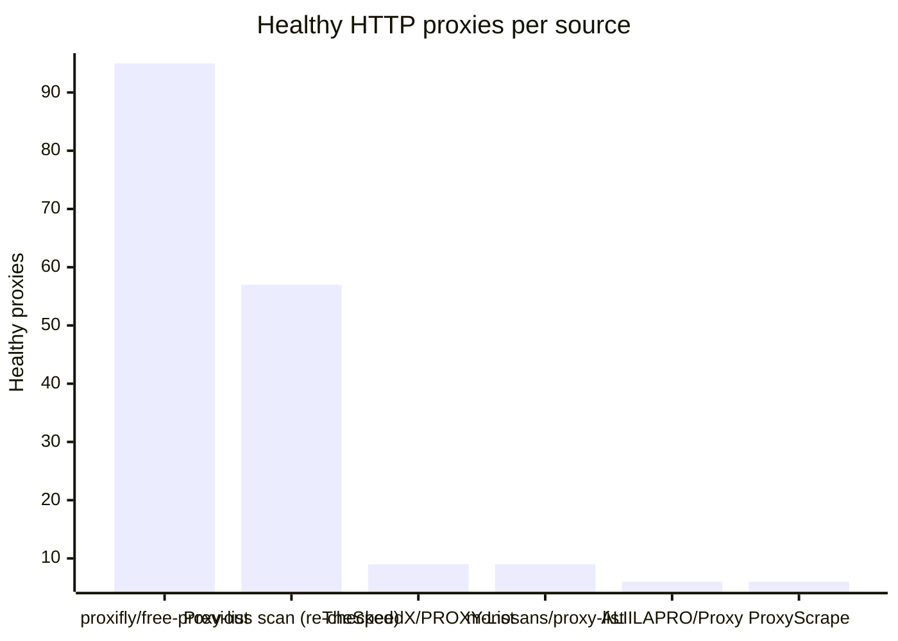
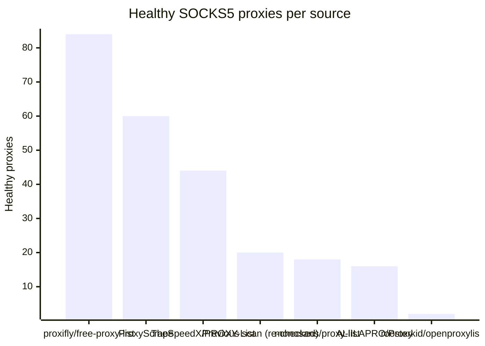

# Proxy Configs

<!-- dynamic timestamp placeholders for workflow sed script -->
channel_stats_chart.svg?v=1789495298
performance_report.html?v=1789495298

### Performance Chart

### Performance Report
[View Report](assets/performance_report.html?v=1789495298)

## HTTP

<!-- STATS:HTTP:START -->

_Last updated: 2026-09-15 12:10 UTC_

| Source | Healthy proxies |
|---|---|
| proxifly/free-proxy-list | 95 |
| Previous scan (re-checked) | 57 |
| TheSpeedX/PROXY-List | 9 |
| monosans/proxy-list | 9 |
| ALIILAPRO/Proxy | 6 |
| ProxyScrape | 6 |
| **Total unique** | **182** |

<!-- STATS:HTTP:END -->

## SOCKS5

<!-- STATS:SOCKS5:START -->

_Last updated: 2026-09-15 12:10 UTC_

| Source | Healthy proxies |
|---|---|
| proxifly/free-proxy-list | 84 |
| ProxyScrape | 60 |
| TheSpeedX/PROXY-List | 44 |
| Previous scan (re-checked) | 20 |
| monosans/proxy-list | 18 |
| ALIILAPRO/Proxy | 16 |
| roosterkid/openproxylist | 2 |
| **Total unique** | **244** |

<!-- STATS:SOCKS5:END -->
