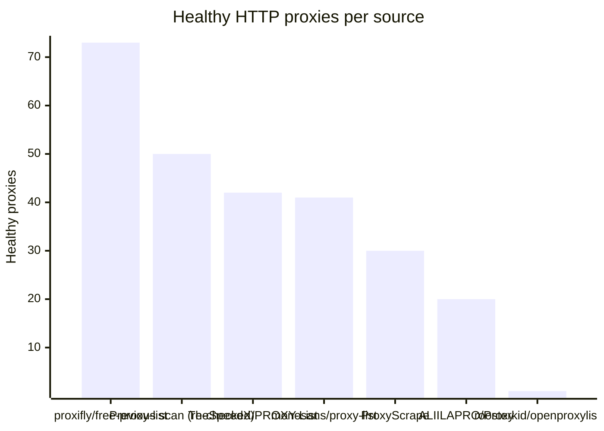
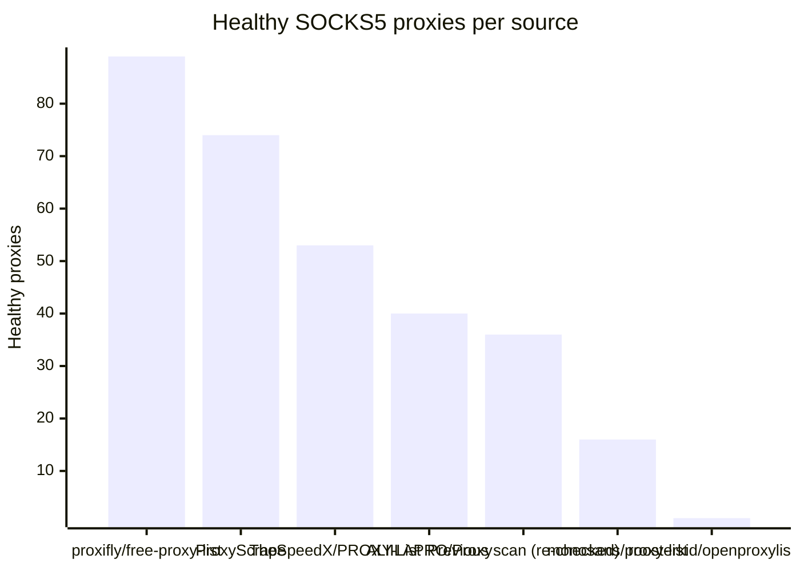

# Proxy Configs

<!-- dynamic timestamp placeholders for workflow sed script -->
channel_stats_chart.svg?v=1789905694
performance_report.html?v=1789905694

### Performance Chart

### Performance Report
[View Report](assets/performance_report.html?v=1789905694)

## HTTP

<!-- STATS:HTTP:START -->

_Last updated: 2026-09-20 06:14 UTC_

| Source | Healthy proxies |
|---|---|
| proxifly/free-proxy-list | 73 |
| Previous scan (re-checked) | 50 |
| TheSpeedX/PROXY-List | 42 |
| monosans/proxy-list | 41 |
| ProxyScrape | 30 |
| ALIILAPRO/Proxy | 20 |
| roosterkid/openproxylist | 1 |
| **Total unique** | **257** |

<!-- STATS:HTTP:END -->

## SOCKS5

<!-- STATS:SOCKS5:START -->

_Last updated: 2026-09-20 06:14 UTC_

| Source | Healthy proxies |
|---|---|
| proxifly/free-proxy-list | 89 |
| ProxyScrape | 74 |
| TheSpeedX/PROXY-List | 53 |
| ALIILAPRO/Proxy | 40 |
| Previous scan (re-checked) | 36 |
| monosans/proxy-list | 16 |
| roosterkid/openproxylist | 1 |
| **Total unique** | **309** |

<!-- STATS:SOCKS5:END -->
