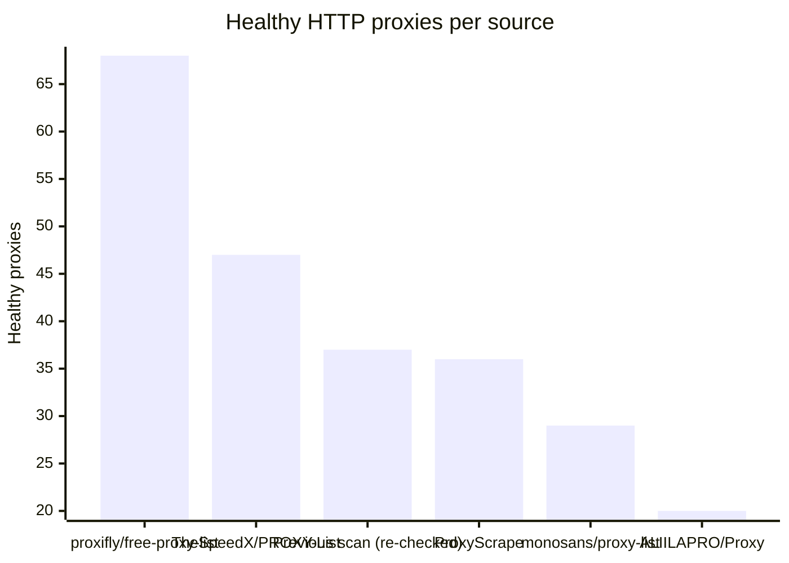
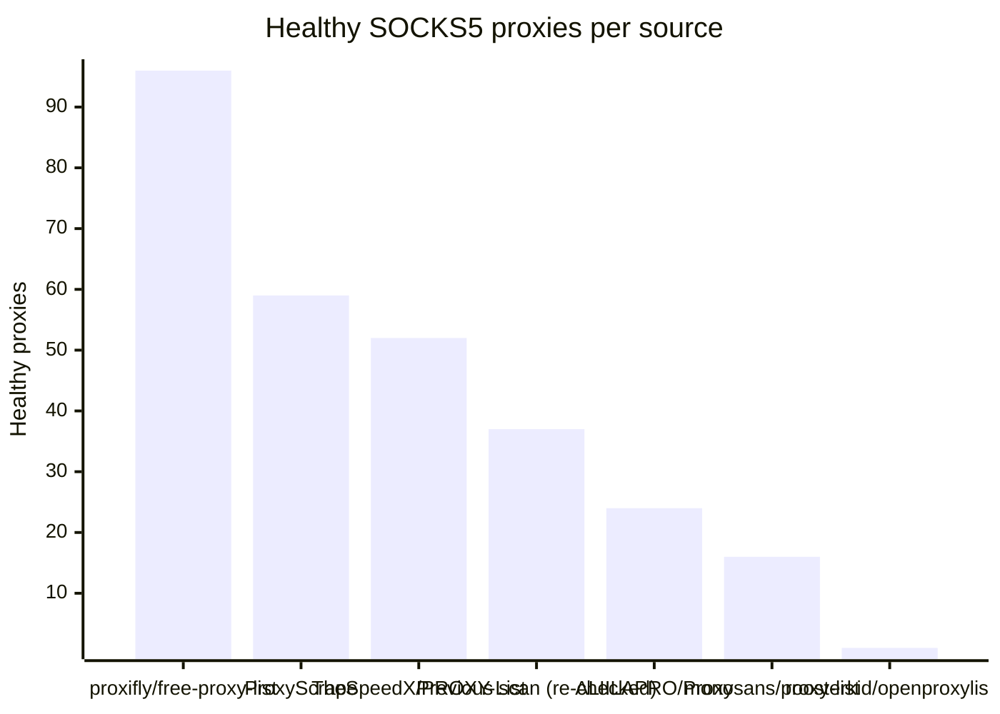

# Proxy Configs

<!-- dynamic timestamp placeholders for workflow sed script -->
channel_stats_chart.svg?v=1790035326
performance_report.html?v=1790035326

### Performance Chart

### Performance Report
[View Report](assets/performance_report.html?v=1790035326)

## HTTP

<!-- STATS:HTTP:START -->

_Last updated: 2026-09-21 18:16 UTC_

| Source | Healthy proxies |
|---|---|
| proxifly/free-proxy-list | 68 |
| TheSpeedX/PROXY-List | 47 |
| Previous scan (re-checked) | 37 |
| ProxyScrape | 36 |
| monosans/proxy-list | 29 |
| ALIILAPRO/Proxy | 20 |
| **Total unique** | **237** |

<!-- STATS:HTTP:END -->

## SOCKS5

<!-- STATS:SOCKS5:START -->

_Last updated: 2026-09-21 18:16 UTC_

| Source | Healthy proxies |
|---|---|
| proxifly/free-proxy-list | 96 |
| ProxyScrape | 59 |
| TheSpeedX/PROXY-List | 52 |
| Previous scan (re-checked) | 37 |
| ALIILAPRO/Proxy | 24 |
| monosans/proxy-list | 16 |
| roosterkid/openproxylist | 1 |
| **Total unique** | **285** |

<!-- STATS:SOCKS5:END -->
