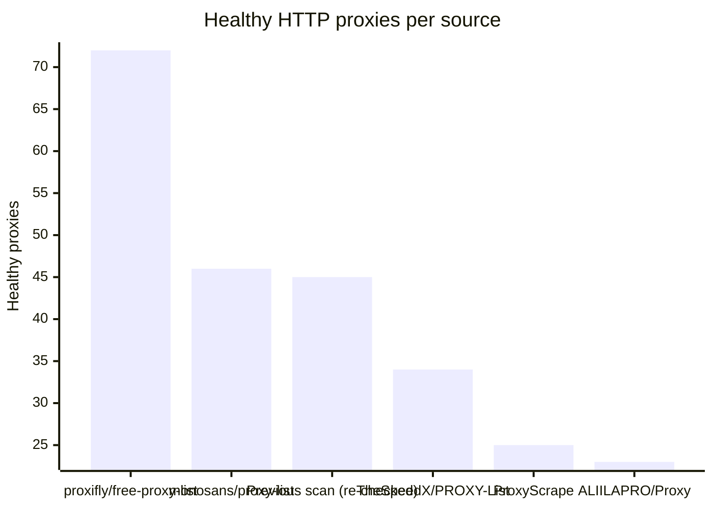
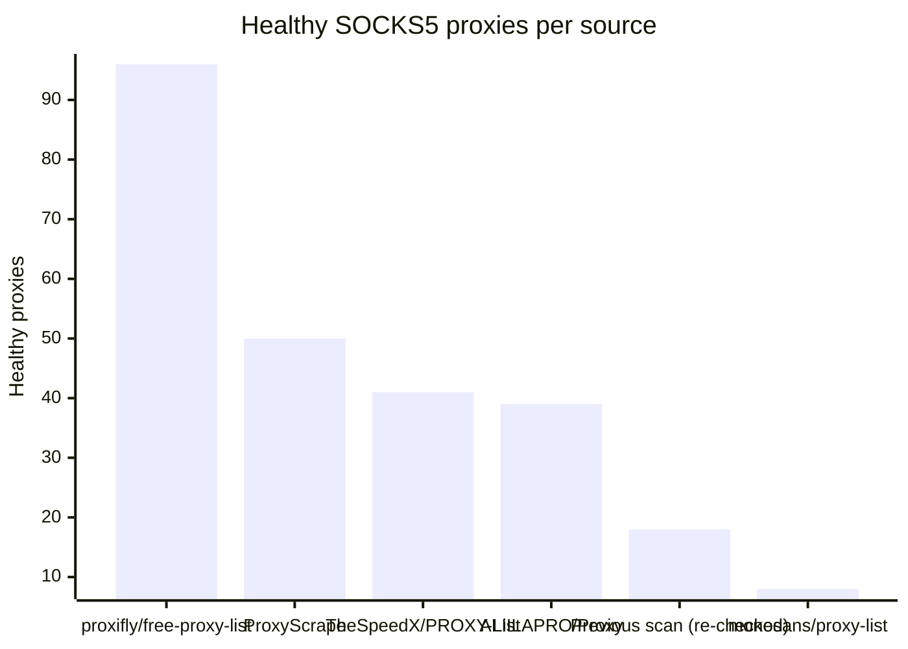

# Proxy Configs

<!-- dynamic timestamp placeholders for workflow sed script -->
channel_stats_chart.svg?v=1789776207
performance_report.html?v=1789776207

### Performance Chart

### Performance Report
[View Report](assets/performance_report.html?v=1789776207)

## HTTP

<!-- STATS:HTTP:START -->

_Last updated: 2026-09-18 18:14 UTC_

| Source | Healthy proxies |
|---|---|
| proxifly/free-proxy-list | 72 |
| monosans/proxy-list | 46 |
| Previous scan (re-checked) | 45 |
| TheSpeedX/PROXY-List | 34 |
| ProxyScrape | 25 |
| ALIILAPRO/Proxy | 23 |
| **Total unique** | **245** |

<!-- STATS:HTTP:END -->

## SOCKS5

<!-- STATS:SOCKS5:START -->

_Last updated: 2026-09-18 18:14 UTC_

| Source | Healthy proxies |
|---|---|
| proxifly/free-proxy-list | 96 |
| ProxyScrape | 50 |
| TheSpeedX/PROXY-List | 41 |
| ALIILAPRO/Proxy | 39 |
| Previous scan (re-checked) | 18 |
| monosans/proxy-list | 8 |
| **Total unique** | **252** |

<!-- STATS:SOCKS5:END -->
