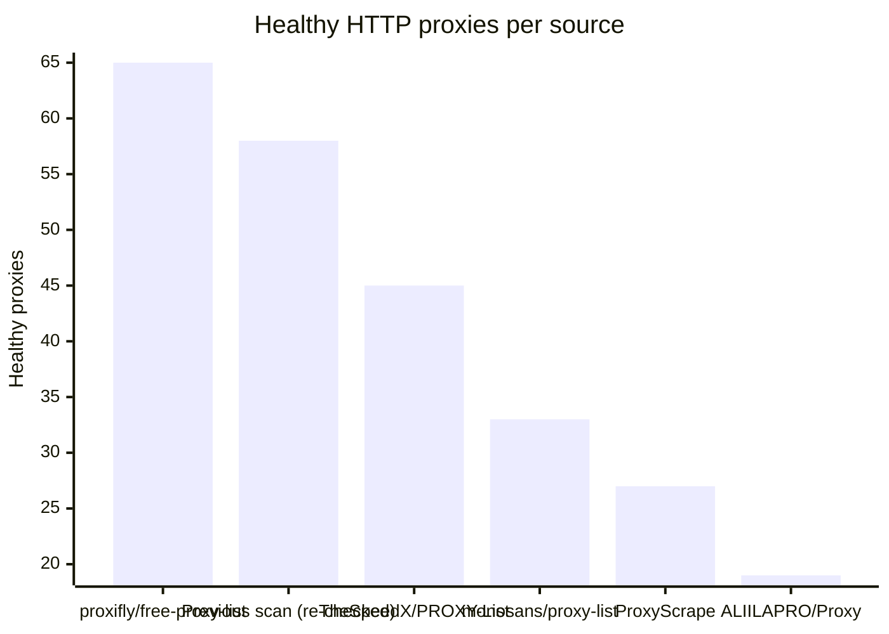
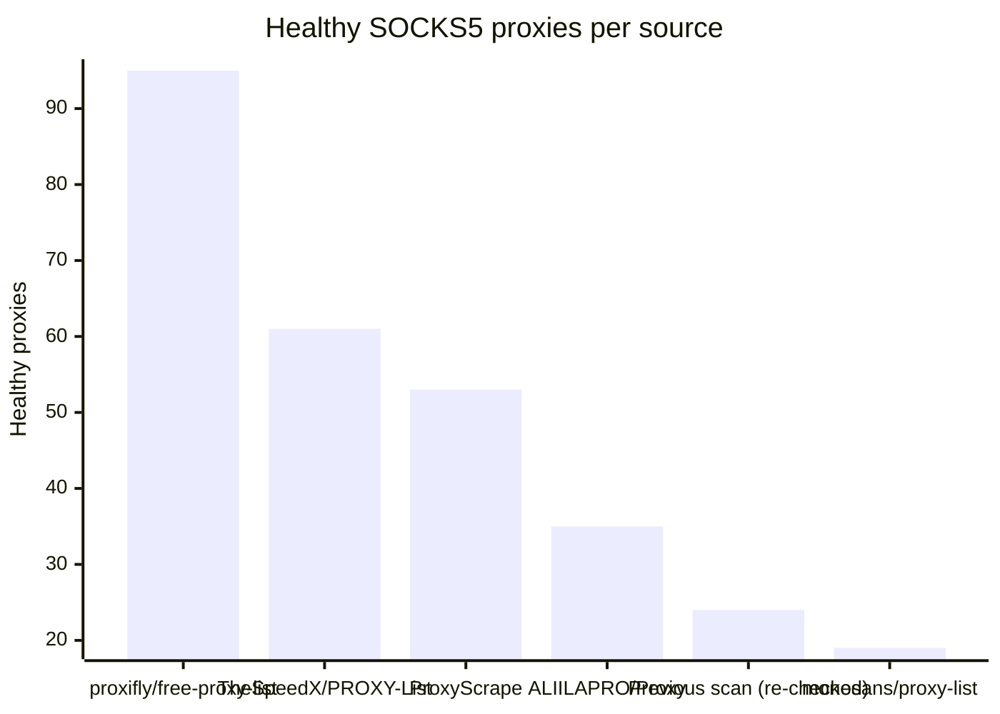

# Proxy Configs

<!-- dynamic timestamp placeholders for workflow sed script -->
channel_stats_chart.svg?v=1789862660
performance_report.html?v=1789862660

### Performance Chart

### Performance Report
[View Report](assets/performance_report.html?v=1789862660)

## HTTP

<!-- STATS:HTTP:START -->

_Last updated: 2026-09-19 18:17 UTC_

| Source | Healthy proxies |
|---|---|
| proxifly/free-proxy-list | 65 |
| Previous scan (re-checked) | 58 |
| TheSpeedX/PROXY-List | 45 |
| monosans/proxy-list | 33 |
| ProxyScrape | 27 |
| ALIILAPRO/Proxy | 19 |
| **Total unique** | **247** |

<!-- STATS:HTTP:END -->

## SOCKS5

<!-- STATS:SOCKS5:START -->

_Last updated: 2026-09-19 18:17 UTC_

| Source | Healthy proxies |
|---|---|
| proxifly/free-proxy-list | 95 |
| TheSpeedX/PROXY-List | 61 |
| ProxyScrape | 53 |
| ALIILAPRO/Proxy | 35 |
| Previous scan (re-checked) | 24 |
| monosans/proxy-list | 19 |
| **Total unique** | **287** |

<!-- STATS:SOCKS5:END -->
