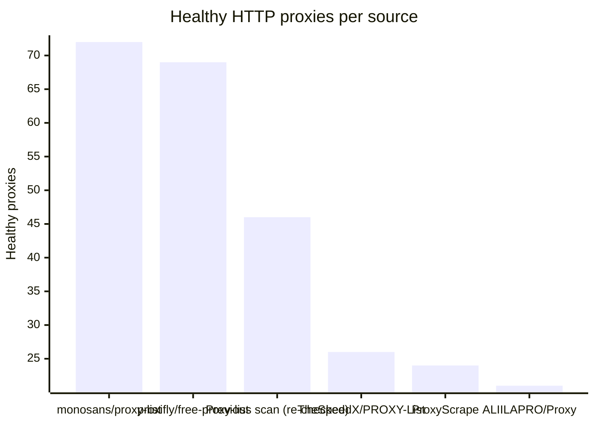
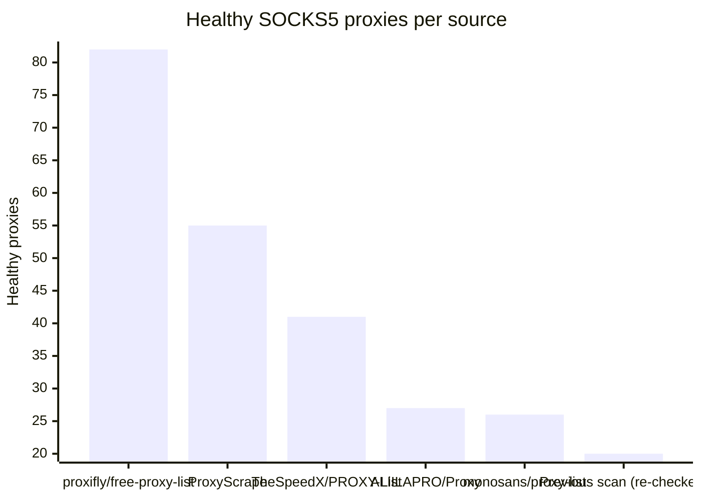

# Proxy Configs

<!-- dynamic timestamp placeholders for workflow sed script -->
channel_stats_chart.svg?v=1789560159
performance_report.html?v=1789560159

### Performance Chart

### Performance Report
[View Report](assets/performance_report.html?v=1789560159)

## HTTP

<!-- STATS:HTTP:START -->

_Last updated: 2026-09-16 06:12 UTC_

| Source | Healthy proxies |
|---|---|
| monosans/proxy-list | 72 |
| proxifly/free-proxy-list | 69 |
| Previous scan (re-checked) | 46 |
| TheSpeedX/PROXY-List | 26 |
| ProxyScrape | 24 |
| ALIILAPRO/Proxy | 21 |
| **Total unique** | **258** |

<!-- STATS:HTTP:END -->

## SOCKS5

<!-- STATS:SOCKS5:START -->

_Last updated: 2026-09-16 06:12 UTC_

| Source | Healthy proxies |
|---|---|
| proxifly/free-proxy-list | 82 |
| ProxyScrape | 55 |
| TheSpeedX/PROXY-List | 41 |
| ALIILAPRO/Proxy | 27 |
| monosans/proxy-list | 26 |
| Previous scan (re-checked) | 20 |
| **Total unique** | **251** |

<!-- STATS:SOCKS5:END -->
