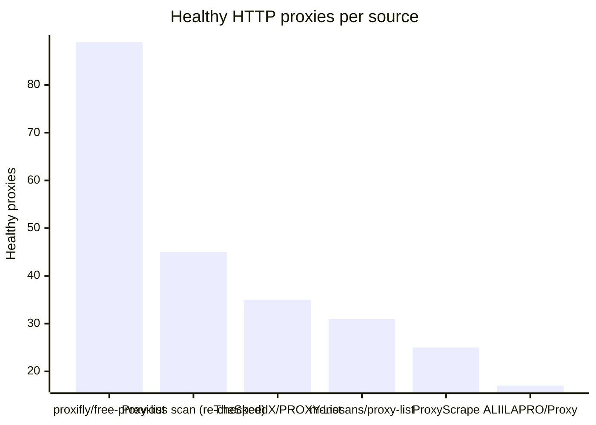
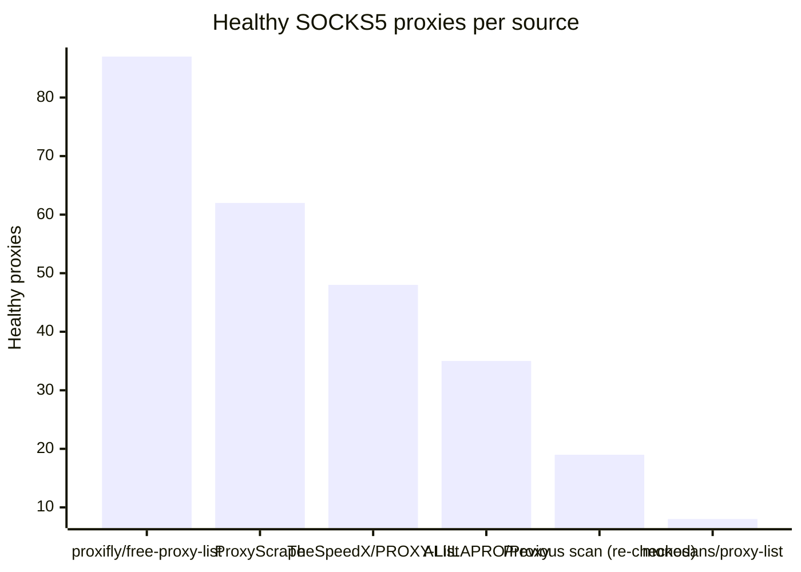

# Proxy Configs

<!-- dynamic timestamp placeholders for workflow sed script -->
channel_stats_chart.svg?v=1789668209
performance_report.html?v=1789668209

### Performance Chart

### Performance Report
[View Report](assets/performance_report.html?v=1789668209)

## HTTP

<!-- STATS:HTTP:START -->

_Last updated: 2026-09-17 12:13 UTC_

| Source | Healthy proxies |
|---|---|
| proxifly/free-proxy-list | 89 |
| Previous scan (re-checked) | 45 |
| TheSpeedX/PROXY-List | 35 |
| monosans/proxy-list | 31 |
| ProxyScrape | 25 |
| ALIILAPRO/Proxy | 17 |
| **Total unique** | **242** |

<!-- STATS:HTTP:END -->

## SOCKS5

<!-- STATS:SOCKS5:START -->

_Last updated: 2026-09-17 12:13 UTC_

| Source | Healthy proxies |
|---|---|
| proxifly/free-proxy-list | 87 |
| ProxyScrape | 62 |
| TheSpeedX/PROXY-List | 48 |
| ALIILAPRO/Proxy | 35 |
| Previous scan (re-checked) | 19 |
| monosans/proxy-list | 8 |
| **Total unique** | **259** |

<!-- STATS:SOCKS5:END -->
