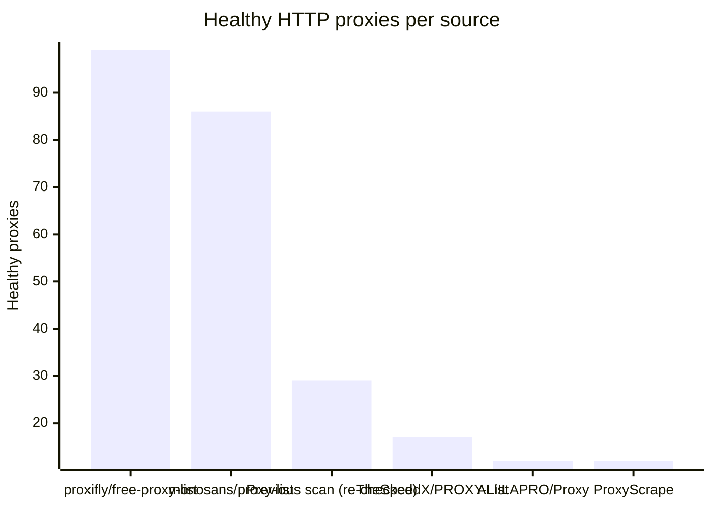
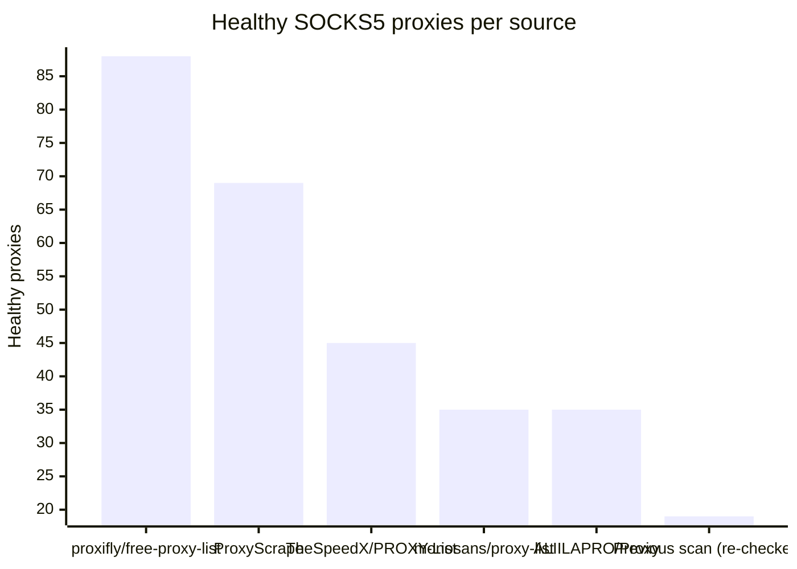

# Proxy Configs

<!-- dynamic timestamp placeholders for workflow sed script -->
channel_stats_chart.svg?v=1789473714
performance_report.html?v=1789473714

### Performance Chart

### Performance Report
[View Report](assets/performance_report.html?v=1789473714)

## HTTP

<!-- STATS:HTTP:START -->

_Last updated: 2026-09-15 06:12 UTC_

| Source | Healthy proxies |
|---|---|
| proxifly/free-proxy-list | 99 |
| monosans/proxy-list | 86 |
| Previous scan (re-checked) | 29 |
| TheSpeedX/PROXY-List | 17 |
| ALIILAPRO/Proxy | 12 |
| ProxyScrape | 12 |
| **Total unique** | **255** |

<!-- STATS:HTTP:END -->

## SOCKS5

<!-- STATS:SOCKS5:START -->

_Last updated: 2026-09-15 06:12 UTC_

| Source | Healthy proxies |
|---|---|
| proxifly/free-proxy-list | 88 |
| ProxyScrape | 69 |
| TheSpeedX/PROXY-List | 45 |
| monosans/proxy-list | 35 |
| ALIILAPRO/Proxy | 35 |
| Previous scan (re-checked) | 19 |
| **Total unique** | **291** |

<!-- STATS:SOCKS5:END -->
