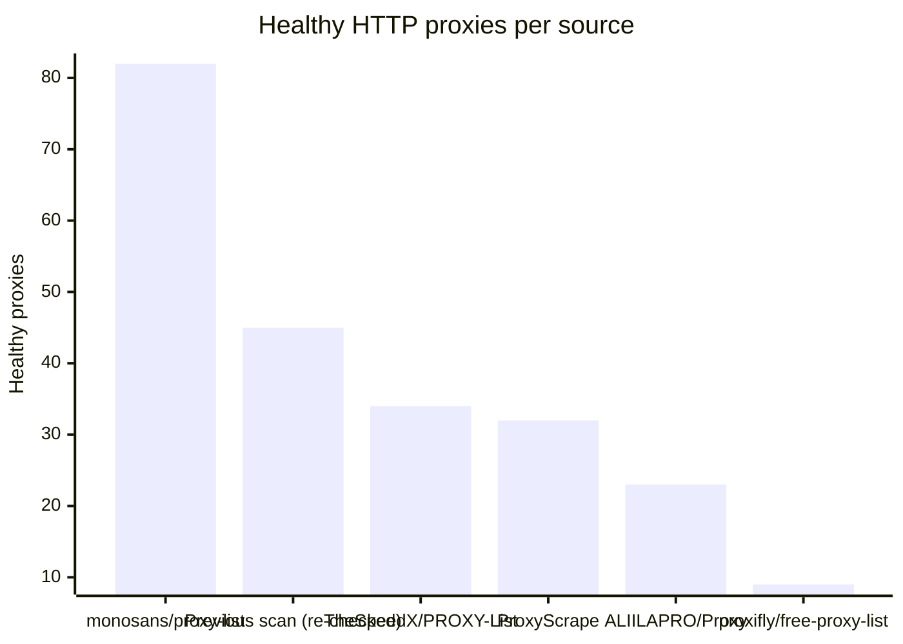
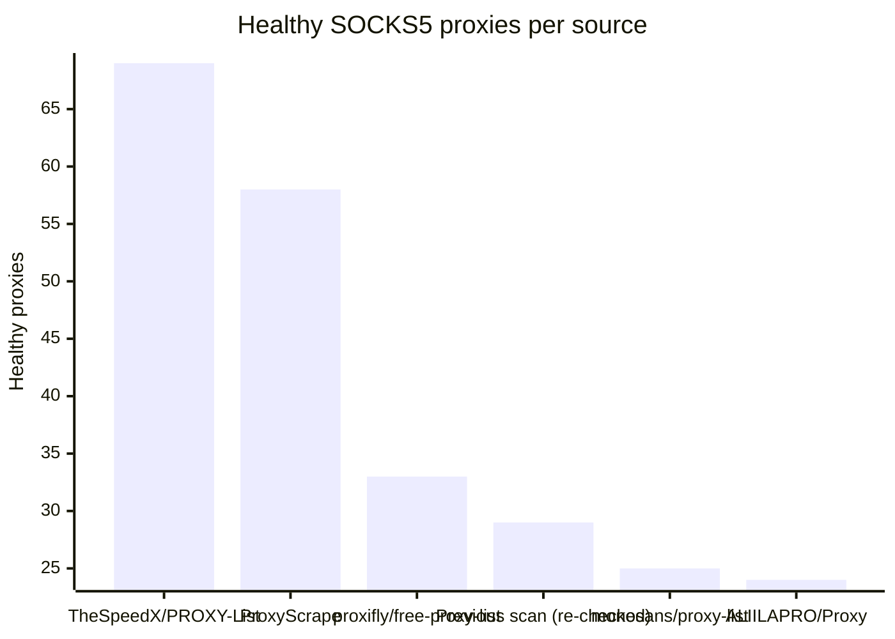

# Proxy Configs

<!-- dynamic timestamp placeholders for workflow sed script -->
channel_stats_chart.svg?v=1788156091
performance_report.html?v=1788156091

### Performance Chart

### Performance Report
[View Report](assets/performance_report.html?v=1788156091)

## HTTP

<!-- STATS:HTTP:START -->

_Last updated: 2026-08-31 00:07 UTC_

| Source | Healthy proxies |
|---|---|
| monosans/proxy-list | 82 |
| Previous scan (re-checked) | 45 |
| TheSpeedX/PROXY-List | 34 |
| ProxyScrape | 32 |
| ALIILAPRO/Proxy | 23 |
| proxifly/free-proxy-list | 9 |
| **Total unique** | **225** |

<!-- STATS:HTTP:END -->

## SOCKS5

<!-- STATS:SOCKS5:START -->

_Last updated: 2026-08-31 00:07 UTC_

| Source | Healthy proxies |
|---|---|
| TheSpeedX/PROXY-List | 69 |
| ProxyScrape | 58 |
| proxifly/free-proxy-list | 33 |
| Previous scan (re-checked) | 29 |
| monosans/proxy-list | 25 |
| ALIILAPRO/Proxy | 24 |
| **Total unique** | **238** |

<!-- STATS:SOCKS5:END -->
