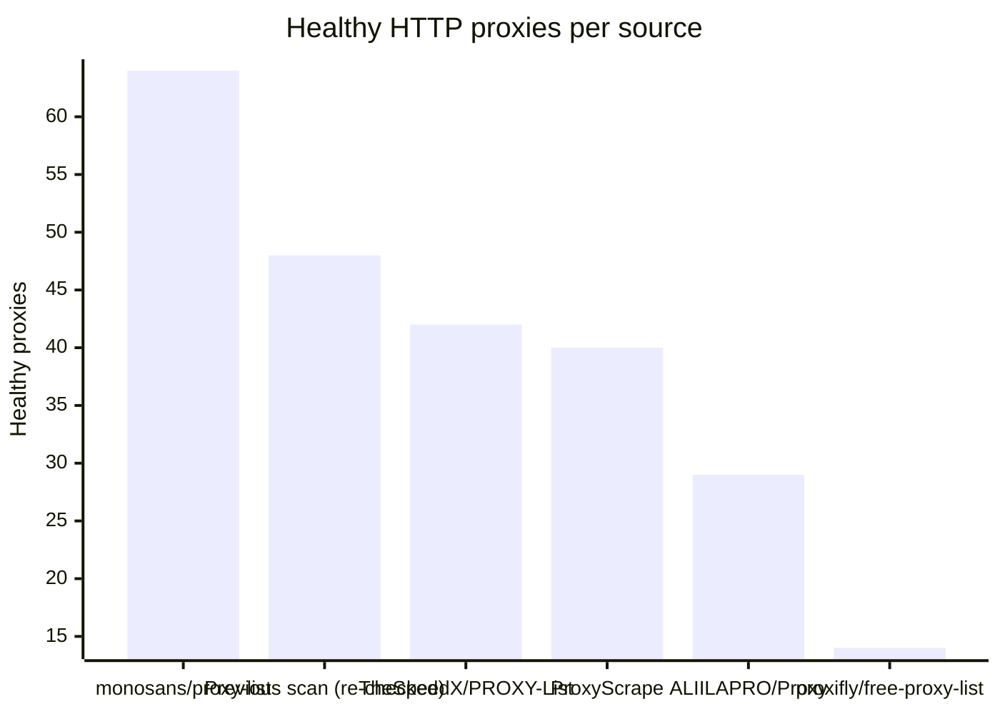
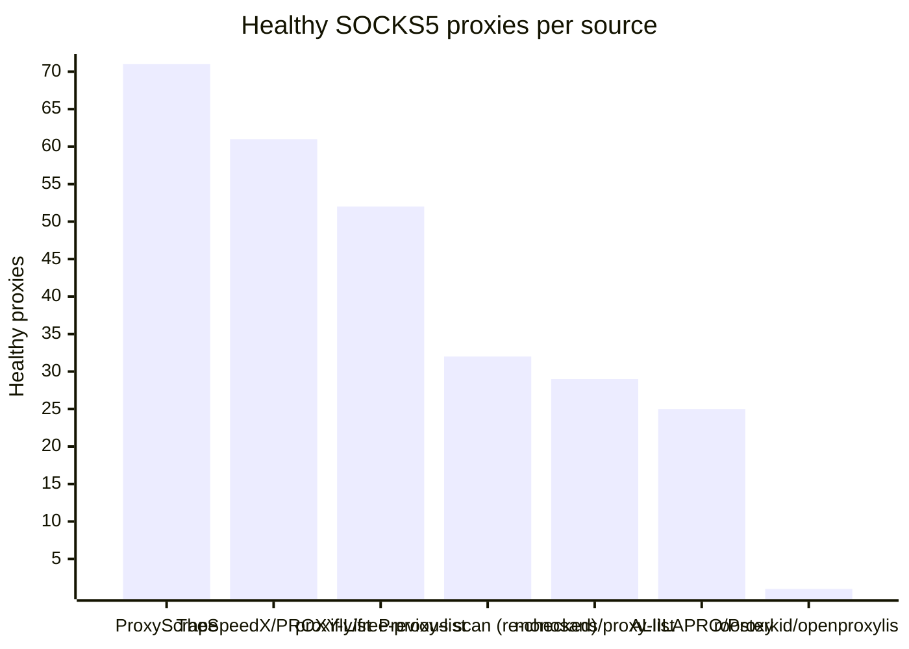

# Proxy Configs

<!-- dynamic timestamp placeholders for workflow sed script -->
channel_stats_chart.svg?v=1788458575
performance_report.html?v=1788458575

### Performance Chart

### Performance Report
[View Report](assets/performance_report.html?v=1788458575)

## HTTP

<!-- STATS:HTTP:START -->

_Last updated: 2026-09-03 12:09 UTC_

| Source | Healthy proxies |
|---|---|
| monosans/proxy-list | 64 |
| Previous scan (re-checked) | 48 |
| TheSpeedX/PROXY-List | 42 |
| ProxyScrape | 40 |
| ALIILAPRO/Proxy | 29 |
| proxifly/free-proxy-list | 14 |
| **Total unique** | **237** |

<!-- STATS:HTTP:END -->

## SOCKS5

<!-- STATS:SOCKS5:START -->

_Last updated: 2026-09-03 12:09 UTC_

| Source | Healthy proxies |
|---|---|
| ProxyScrape | 71 |
| TheSpeedX/PROXY-List | 61 |
| proxifly/free-proxy-list | 52 |
| Previous scan (re-checked) | 32 |
| monosans/proxy-list | 29 |
| ALIILAPRO/Proxy | 25 |
| roosterkid/openproxylist | 1 |
| **Total unique** | **271** |

<!-- STATS:SOCKS5:END -->
