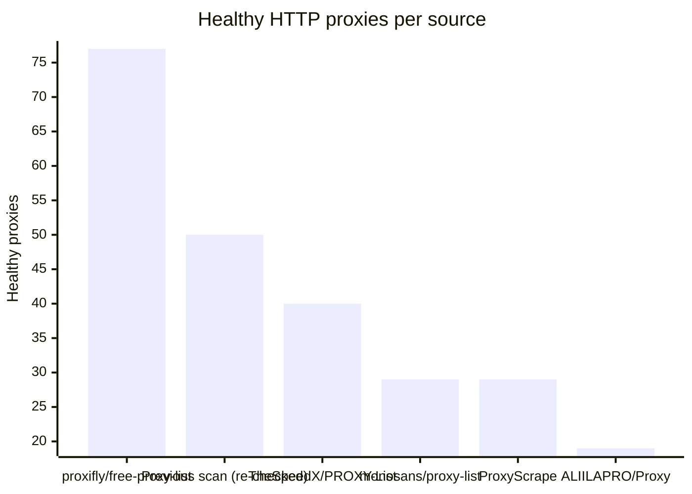
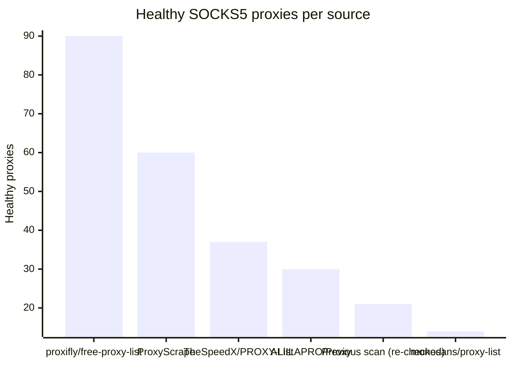

# Proxy Configs

<!-- dynamic timestamp placeholders for workflow sed script -->
channel_stats_chart.svg?v=1789689859
performance_report.html?v=1789689859

### Performance Chart

### Performance Report
[View Report](assets/performance_report.html?v=1789689859)

## HTTP

<!-- STATS:HTTP:START -->

_Last updated: 2026-09-17 18:14 UTC_

| Source | Healthy proxies |
|---|---|
| proxifly/free-proxy-list | 77 |
| Previous scan (re-checked) | 50 |
| TheSpeedX/PROXY-List | 40 |
| monosans/proxy-list | 29 |
| ProxyScrape | 29 |
| ALIILAPRO/Proxy | 19 |
| **Total unique** | **244** |

<!-- STATS:HTTP:END -->

## SOCKS5

<!-- STATS:SOCKS5:START -->

_Last updated: 2026-09-17 18:14 UTC_

| Source | Healthy proxies |
|---|---|
| proxifly/free-proxy-list | 90 |
| ProxyScrape | 60 |
| TheSpeedX/PROXY-List | 37 |
| ALIILAPRO/Proxy | 30 |
| Previous scan (re-checked) | 21 |
| monosans/proxy-list | 14 |
| **Total unique** | **252** |

<!-- STATS:SOCKS5:END -->
