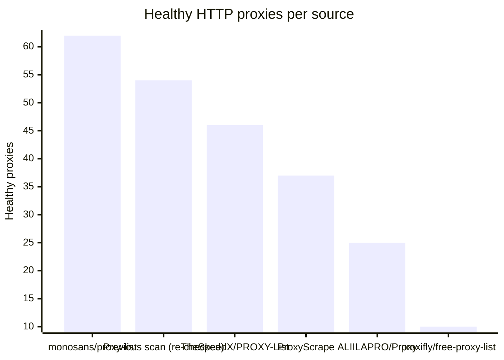
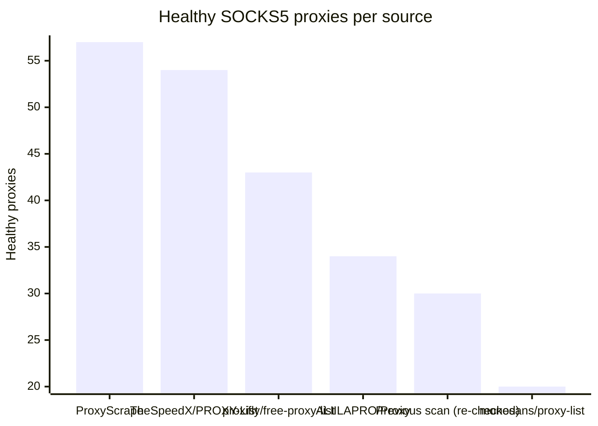

# Proxy Configs

<!-- dynamic timestamp placeholders for workflow sed script -->
channel_stats_chart.svg?v=1788912079
performance_report.html?v=1788912079

### Performance Chart

### Performance Report
[View Report](assets/performance_report.html?v=1788912079)

## HTTP

<!-- STATS:HTTP:START -->

_Last updated: 2026-09-08 18:08 UTC_

| Source | Healthy proxies |
|---|---|
| monosans/proxy-list | 62 |
| Previous scan (re-checked) | 54 |
| TheSpeedX/PROXY-List | 46 |
| ProxyScrape | 37 |
| ALIILAPRO/Proxy | 25 |
| proxifly/free-proxy-list | 10 |
| **Total unique** | **234** |

<!-- STATS:HTTP:END -->

## SOCKS5

<!-- STATS:SOCKS5:START -->

_Last updated: 2026-09-08 18:08 UTC_

| Source | Healthy proxies |
|---|---|
| ProxyScrape | 57 |
| TheSpeedX/PROXY-List | 54 |
| proxifly/free-proxy-list | 43 |
| ALIILAPRO/Proxy | 34 |
| Previous scan (re-checked) | 30 |
| monosans/proxy-list | 20 |
| **Total unique** | **238** |

<!-- STATS:SOCKS5:END -->
