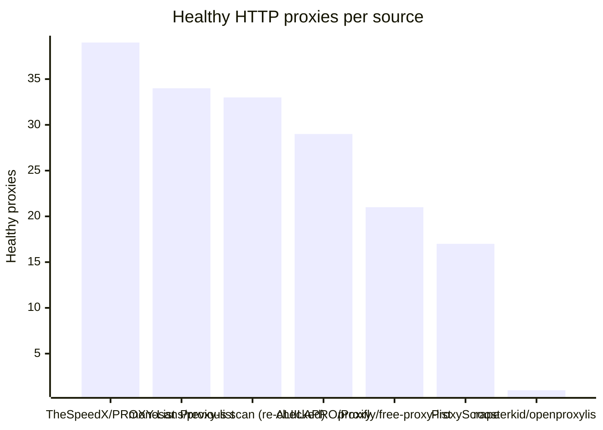
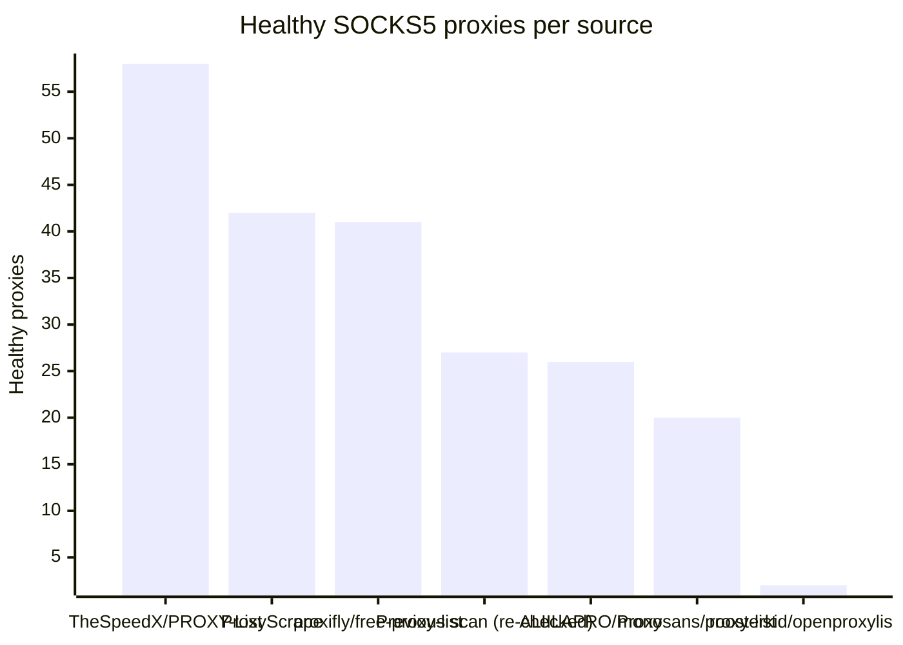

# Proxy Configs

<!-- dynamic timestamp placeholders for workflow sed script -->
channel_stats_chart.svg?v=1788976911
performance_report.html?v=1788976911

### Performance Chart

### Performance Report
[View Report](assets/performance_report.html?v=1788976911)

## HTTP

<!-- STATS:HTTP:START -->

_Last updated: 2026-09-09 12:06 UTC_

| Source | Healthy proxies |
|---|---|
| TheSpeedX/PROXY-List | 39 |
| monosans/proxy-list | 34 |
| Previous scan (re-checked) | 33 |
| ALIILAPRO/Proxy | 29 |
| proxifly/free-proxy-list | 21 |
| ProxyScrape | 17 |
| roosterkid/openproxylist | 1 |
| **Total unique** | **174** |

<!-- STATS:HTTP:END -->

## SOCKS5

<!-- STATS:SOCKS5:START -->

_Last updated: 2026-09-09 12:06 UTC_

| Source | Healthy proxies |
|---|---|
| TheSpeedX/PROXY-List | 58 |
| ProxyScrape | 42 |
| proxifly/free-proxy-list | 41 |
| Previous scan (re-checked) | 27 |
| ALIILAPRO/Proxy | 26 |
| monosans/proxy-list | 20 |
| roosterkid/openproxylist | 2 |
| **Total unique** | **216** |

<!-- STATS:SOCKS5:END -->
