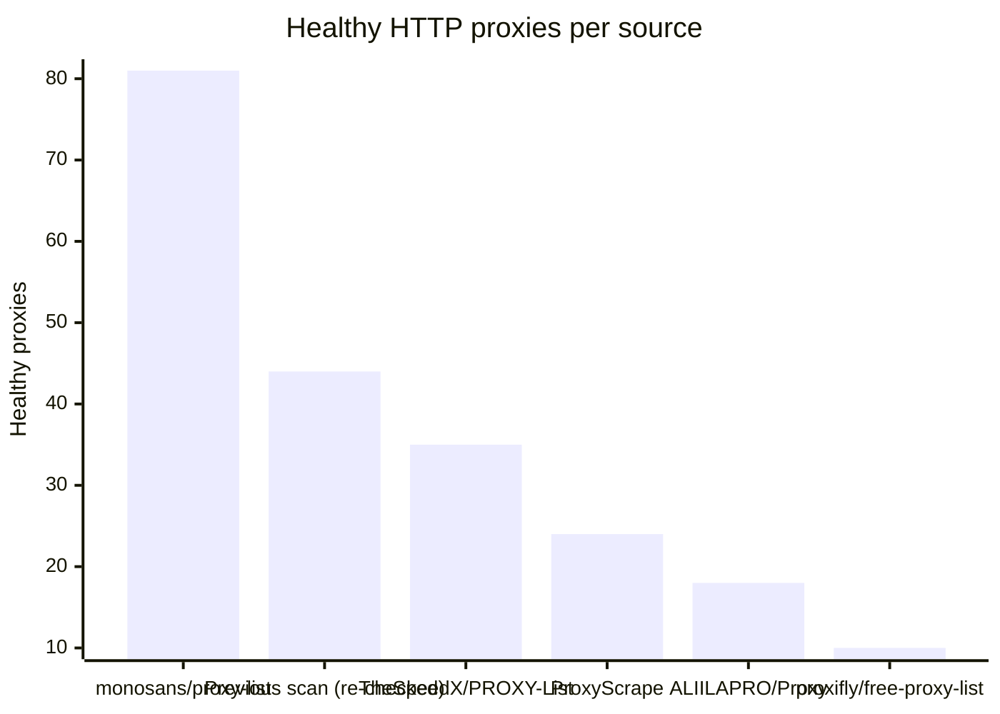
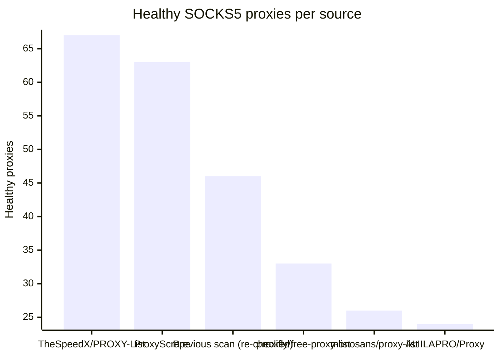

# Proxy Configs

<!-- dynamic timestamp placeholders for workflow sed script -->
channel_stats_chart.svg?v=1788030873
performance_report.html?v=1788030873

### Performance Chart

### Performance Report
[View Report](assets/performance_report.html?v=1788030873)

## HTTP

<!-- STATS:HTTP:START -->

_Last updated: 2026-08-29 20:09 UTC_

| Source | Healthy proxies |
|---|---|
| monosans/proxy-list | 81 |
| Previous scan (re-checked) | 44 |
| TheSpeedX/PROXY-List | 35 |
| ProxyScrape | 24 |
| ALIILAPRO/Proxy | 18 |
| proxifly/free-proxy-list | 10 |
| **Total unique** | **212** |

<!-- STATS:HTTP:END -->

## SOCKS5

<!-- STATS:SOCKS5:START -->

_Last updated: 2026-08-29 20:09 UTC_

| Source | Healthy proxies |
|---|---|
| TheSpeedX/PROXY-List | 67 |
| ProxyScrape | 63 |
| Previous scan (re-checked) | 46 |
| proxifly/free-proxy-list | 33 |
| monosans/proxy-list | 26 |
| ALIILAPRO/Proxy | 24 |
| **Total unique** | **259** |

<!-- STATS:SOCKS5:END -->
