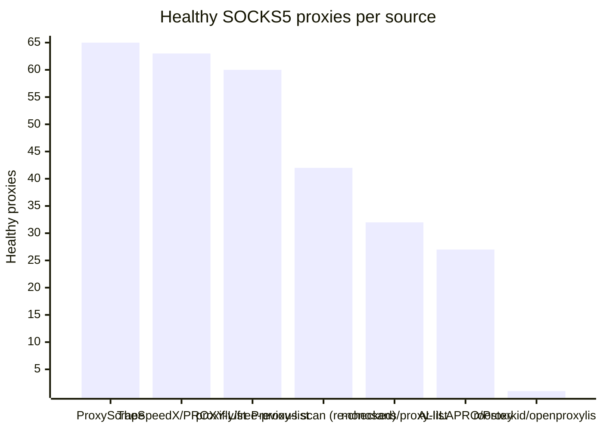

# Proxy Configs

<!-- dynamic timestamp placeholders for workflow sed script -->
channel_stats_chart.svg?v=1788415319
performance_report.html?v=1788415319

### Performance Chart

### Performance Report
[View Report](assets/performance_report.html?v=1788415319)

## HTTP

<!-- STATS:HTTP:START -->

_Last updated: 2026-09-03 00:07 UTC_

| Source | Healthy proxies |
|---|---|
| monosans/proxy-list | 63 |
| Previous scan (re-checked) | 54 |
| TheSpeedX/PROXY-List | 47 |
| ProxyScrape | 32 |
| ALIILAPRO/Proxy | 22 |
| proxifly/free-proxy-list | 8 |
| **Total unique** | **226** |

<!-- STATS:HTTP:END -->

## SOCKS5

<!-- STATS:SOCKS5:START -->

_Last updated: 2026-09-03 00:07 UTC_

| Source | Healthy proxies |
|---|---|
| ProxyScrape | 65 |
| TheSpeedX/PROXY-List | 63 |
| proxifly/free-proxy-list | 60 |
| Previous scan (re-checked) | 42 |
| monosans/proxy-list | 32 |
| ALIILAPRO/Proxy | 27 |
| roosterkid/openproxylist | 1 |
| **Total unique** | **290** |

<!-- STATS:SOCKS5:END -->
