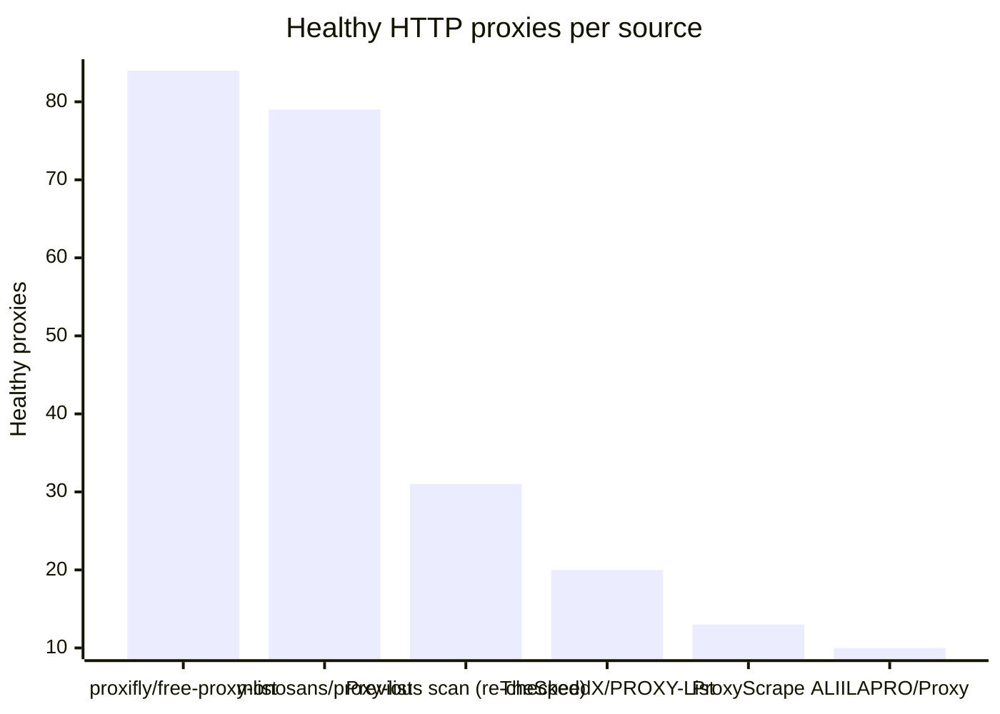
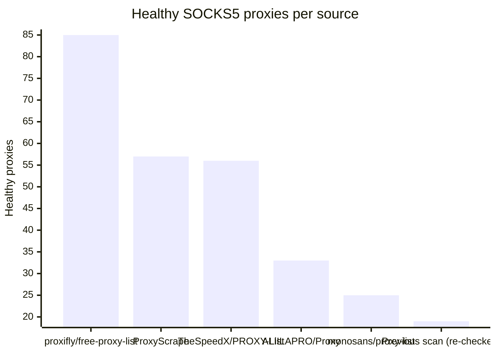

# Proxy Configs

<!-- dynamic timestamp placeholders for workflow sed script -->
channel_stats_chart.svg?v=1788030873
performance_report.html?v=1788030873

### Performance Chart

### Performance Report
[View Report](assets/performance_report.html?v=1788030873)

## HTTP

<!-- STATS:HTTP:START -->

_Last updated: 2026-09-16 00:13 UTC_

| Source | Healthy proxies |
|---|---|
| proxifly/free-proxy-list | 84 |
| monosans/proxy-list | 79 |
| Previous scan (re-checked) | 31 |
| TheSpeedX/PROXY-List | 20 |
| ProxyScrape | 13 |
| ALIILAPRO/Proxy | 10 |
| **Total unique** | **237** |

<!-- STATS:HTTP:END -->

## SOCKS5

<!-- STATS:SOCKS5:START -->

_Last updated: 2026-09-16 00:13 UTC_

| Source | Healthy proxies |
|---|---|
| proxifly/free-proxy-list | 85 |
| ProxyScrape | 57 |
| TheSpeedX/PROXY-List | 56 |
| ALIILAPRO/Proxy | 33 |
| monosans/proxy-list | 25 |
| Previous scan (re-checked) | 19 |
| **Total unique** | **275** |

<!-- STATS:SOCKS5:END -->
