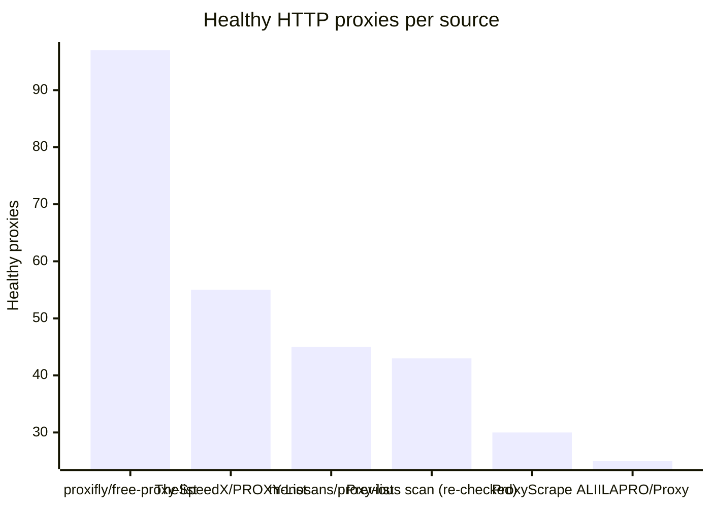
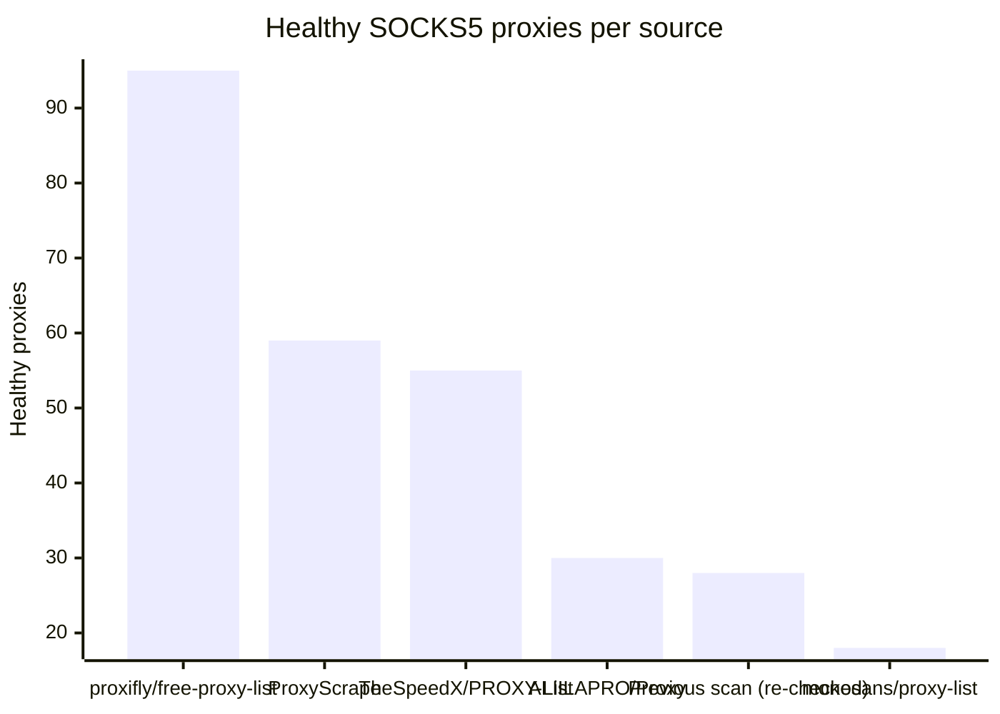

# Proxy Configs

<!-- dynamic timestamp placeholders for workflow sed script -->
channel_stats_chart.svg?v=1790316090
performance_report.html?v=1790316090

### Performance Chart

### Performance Report
[View Report](assets/performance_report.html?v=1790316090)

## HTTP

<!-- STATS:HTTP:START -->

_Last updated: 2026-09-25 00:16 UTC_

| Source | Healthy proxies |
|---|---|
| proxifly/free-proxy-list | 97 |
| TheSpeedX/PROXY-List | 55 |
| monosans/proxy-list | 45 |
| Previous scan (re-checked) | 43 |
| ProxyScrape | 30 |
| ALIILAPRO/Proxy | 25 |
| **Total unique** | **295** |

<!-- STATS:HTTP:END -->

## SOCKS5

<!-- STATS:SOCKS5:START -->

_Last updated: 2026-09-25 00:16 UTC_

| Source | Healthy proxies |
|---|---|
| proxifly/free-proxy-list | 95 |
| ProxyScrape | 59 |
| TheSpeedX/PROXY-List | 55 |
| ALIILAPRO/Proxy | 30 |
| Previous scan (re-checked) | 28 |
| monosans/proxy-list | 18 |
| **Total unique** | **285** |

<!-- STATS:SOCKS5:END -->
