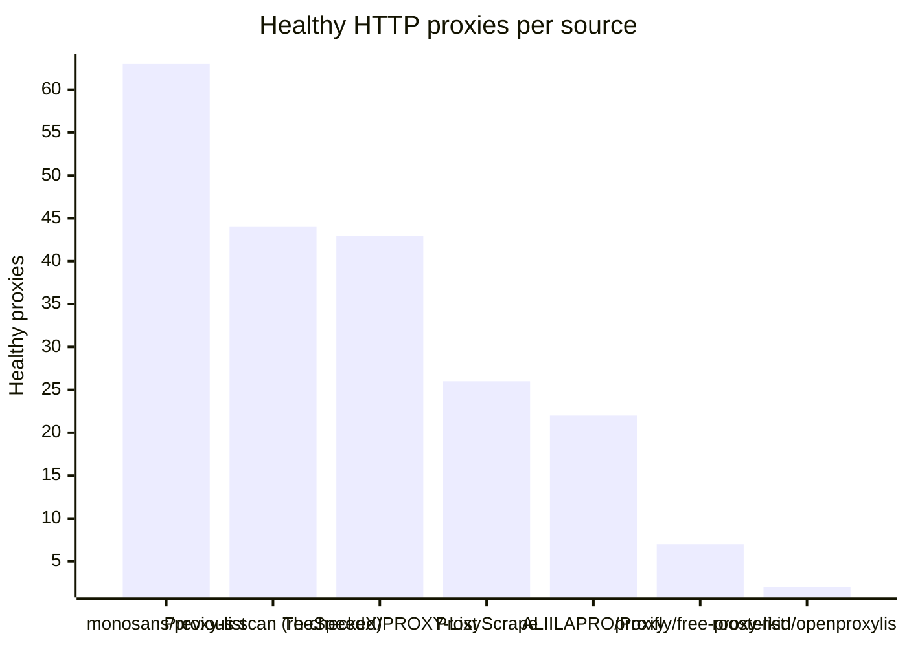
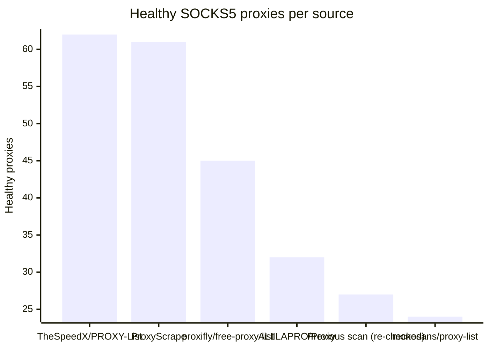

# Proxy Configs

<!-- dynamic timestamp placeholders for workflow sed script -->
channel_stats_chart.svg?v=1789106461
performance_report.html?v=1789106461

### Performance Chart

### Performance Report
[View Report](assets/performance_report.html?v=1789106461)

## HTTP

<!-- STATS:HTTP:START -->

_Last updated: 2026-09-11 00:07 UTC_

| Source | Healthy proxies |
|---|---|
| monosans/proxy-list | 63 |
| Previous scan (re-checked) | 44 |
| TheSpeedX/PROXY-List | 43 |
| ProxyScrape | 26 |
| ALIILAPRO/Proxy | 22 |
| proxifly/free-proxy-list | 7 |
| roosterkid/openproxylist | 2 |
| **Total unique** | **207** |

<!-- STATS:HTTP:END -->

## SOCKS5

<!-- STATS:SOCKS5:START -->

_Last updated: 2026-09-11 00:07 UTC_

| Source | Healthy proxies |
|---|---|
| TheSpeedX/PROXY-List | 62 |
| ProxyScrape | 61 |
| proxifly/free-proxy-list | 45 |
| ALIILAPRO/Proxy | 32 |
| Previous scan (re-checked) | 27 |
| monosans/proxy-list | 24 |
| **Total unique** | **251** |

<!-- STATS:SOCKS5:END -->
