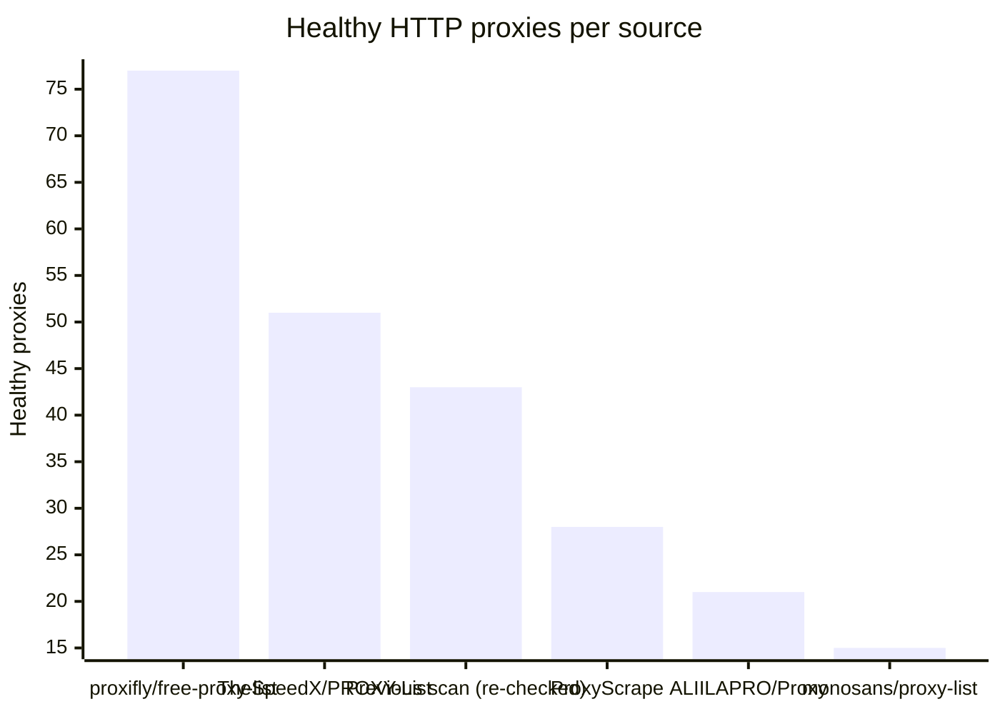
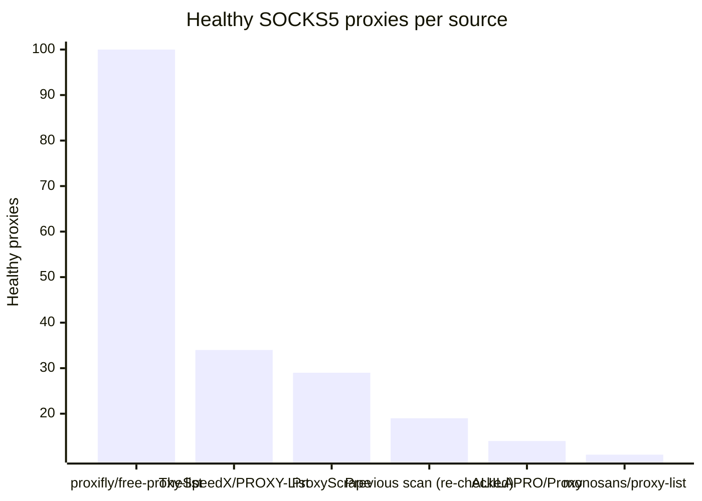

# Proxy Configs

<!-- dynamic timestamp placeholders for workflow sed script -->
channel_stats_chart.svg?v=1788030873
performance_report.html?v=1788030873

### Performance Chart

### Performance Report
[View Report](assets/performance_report.html?v=1788030873)

## HTTP

<!-- STATS:HTTP:START -->

_Last updated: 2026-09-26 18:18 UTC_

| Source | Healthy proxies |
|---|---|
| proxifly/free-proxy-list | 77 |
| TheSpeedX/PROXY-List | 51 |
| Previous scan (re-checked) | 43 |
| ProxyScrape | 28 |
| ALIILAPRO/Proxy | 21 |
| monosans/proxy-list | 15 |
| **Total unique** | **235** |

<!-- STATS:HTTP:END -->

## SOCKS5

<!-- STATS:SOCKS5:START -->

_Last updated: 2026-09-26 18:18 UTC_

| Source | Healthy proxies |
|---|---|
| proxifly/free-proxy-list | 100 |
| TheSpeedX/PROXY-List | 34 |
| ProxyScrape | 29 |
| Previous scan (re-checked) | 19 |
| ALIILAPRO/Proxy | 14 |
| monosans/proxy-list | 11 |
| **Total unique** | **207** |

<!-- STATS:SOCKS5:END -->
