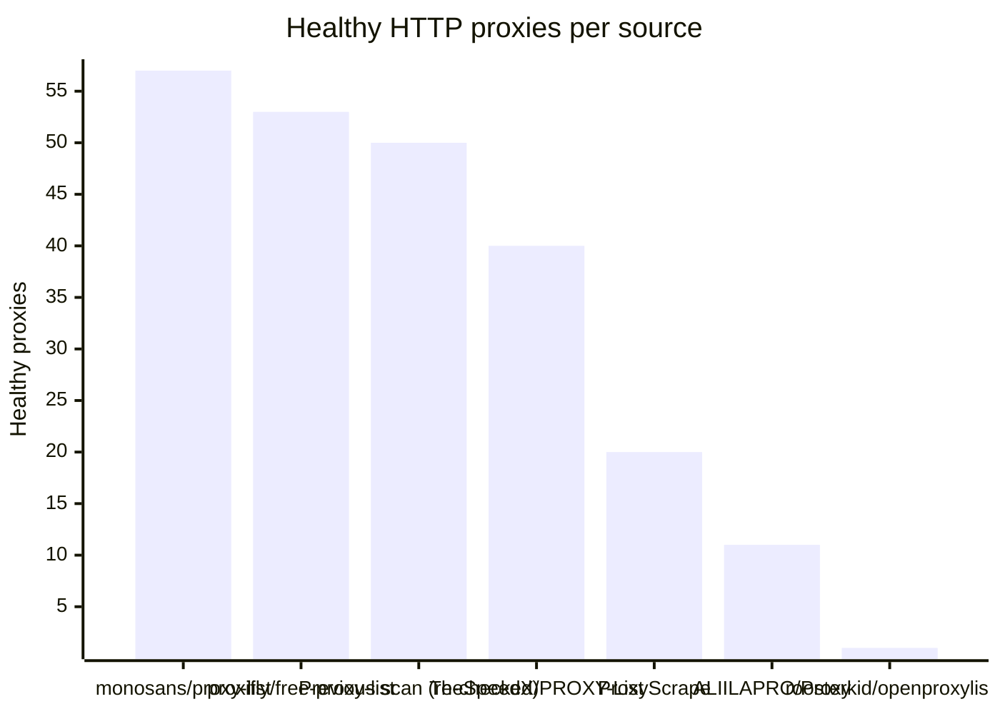
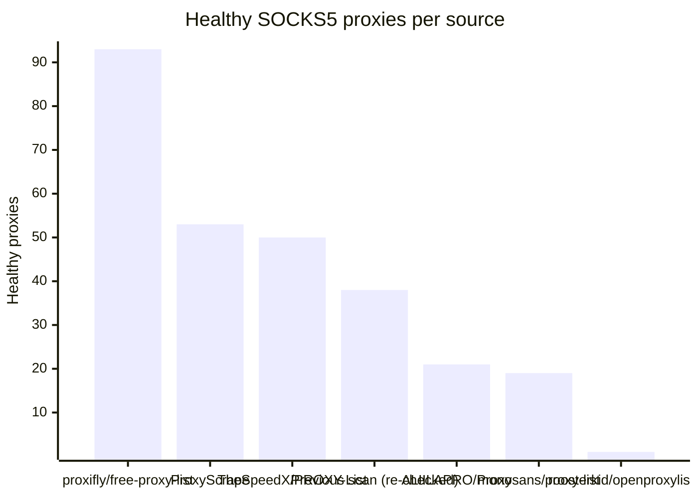

# Proxy Configs

<!-- dynamic timestamp placeholders for workflow sed script -->
channel_stats_chart.svg?v=1788030873
performance_report.html?v=1788030873

### Performance Chart

### Performance Report
[View Report](assets/performance_report.html?v=1788030873)

## HTTP

<!-- STATS:HTTP:START -->

_Last updated: 2026-09-22 00:15 UTC_

| Source | Healthy proxies |
|---|---|
| monosans/proxy-list | 57 |
| proxifly/free-proxy-list | 53 |
| Previous scan (re-checked) | 50 |
| TheSpeedX/PROXY-List | 40 |
| ProxyScrape | 20 |
| ALIILAPRO/Proxy | 11 |
| roosterkid/openproxylist | 1 |
| **Total unique** | **232** |

<!-- STATS:HTTP:END -->

## SOCKS5

<!-- STATS:SOCKS5:START -->

_Last updated: 2026-09-22 00:15 UTC_

| Source | Healthy proxies |
|---|---|
| proxifly/free-proxy-list | 93 |
| ProxyScrape | 53 |
| TheSpeedX/PROXY-List | 50 |
| Previous scan (re-checked) | 38 |
| ALIILAPRO/Proxy | 21 |
| monosans/proxy-list | 19 |
| roosterkid/openproxylist | 1 |
| **Total unique** | **275** |

<!-- STATS:SOCKS5:END -->
