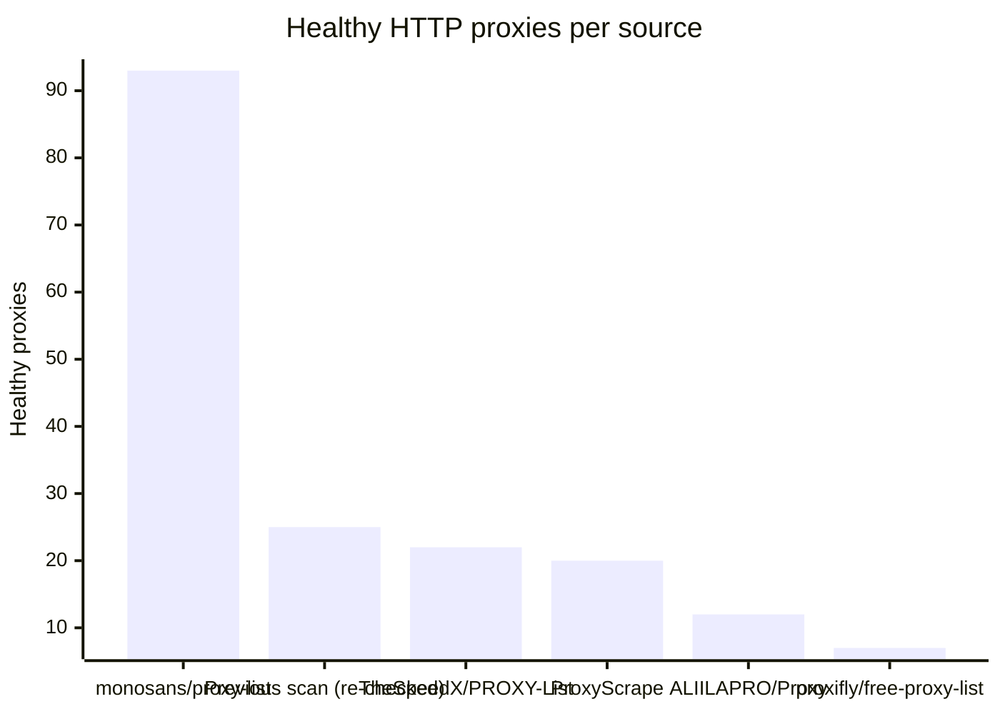
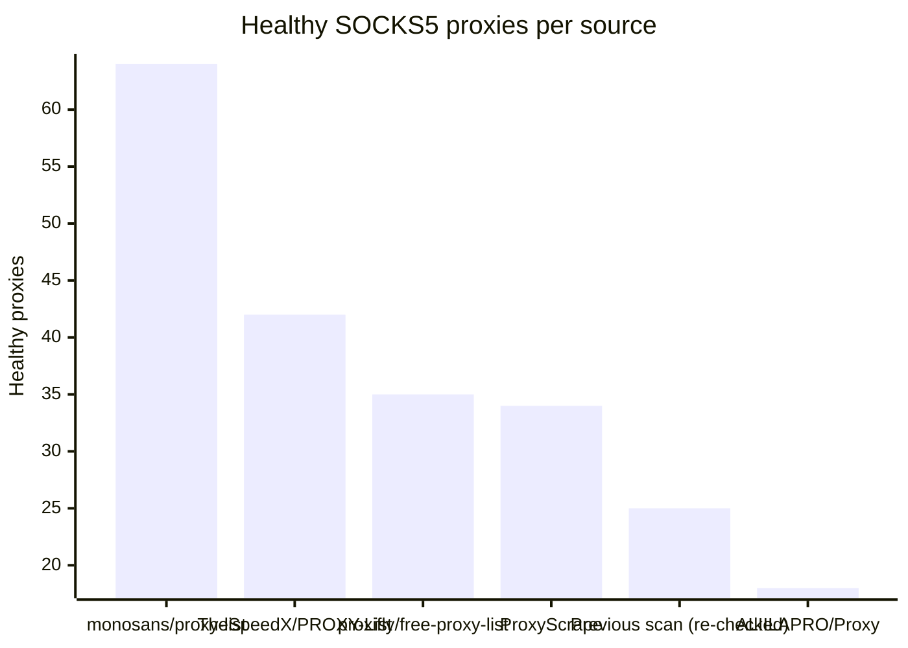

# Proxy Configs

<!-- dynamic timestamp placeholders for workflow sed script -->
channel_stats_chart.svg?v=1788066829
performance_report.html?v=1788066829

### Performance Chart

### Performance Report
[View Report](assets/performance_report.html?v=1788066829)

## HTTP

<!-- STATS:HTTP:START -->

_Last updated: 2026-08-30 04:38 UTC_

| Source | Healthy proxies |
|---|---|
| monosans/proxy-list | 93 |
| Previous scan (re-checked) | 25 |
| TheSpeedX/PROXY-List | 22 |
| ProxyScrape | 20 |
| ALIILAPRO/Proxy | 12 |
| proxifly/free-proxy-list | 7 |
| **Total unique** | **179** |

<!-- STATS:HTTP:END -->

## SOCKS5

<!-- STATS:SOCKS5:START -->

_Last updated: 2026-08-30 04:38 UTC_

| Source | Healthy proxies |
|---|---|
| monosans/proxy-list | 64 |
| TheSpeedX/PROXY-List | 42 |
| proxifly/free-proxy-list | 35 |
| ProxyScrape | 34 |
| Previous scan (re-checked) | 25 |
| ALIILAPRO/Proxy | 18 |
| **Total unique** | **218** |

<!-- STATS:SOCKS5:END -->
