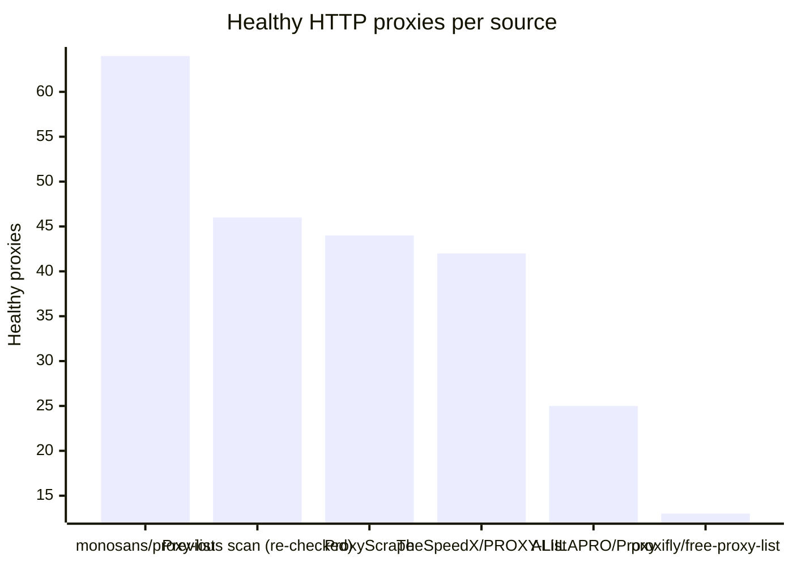
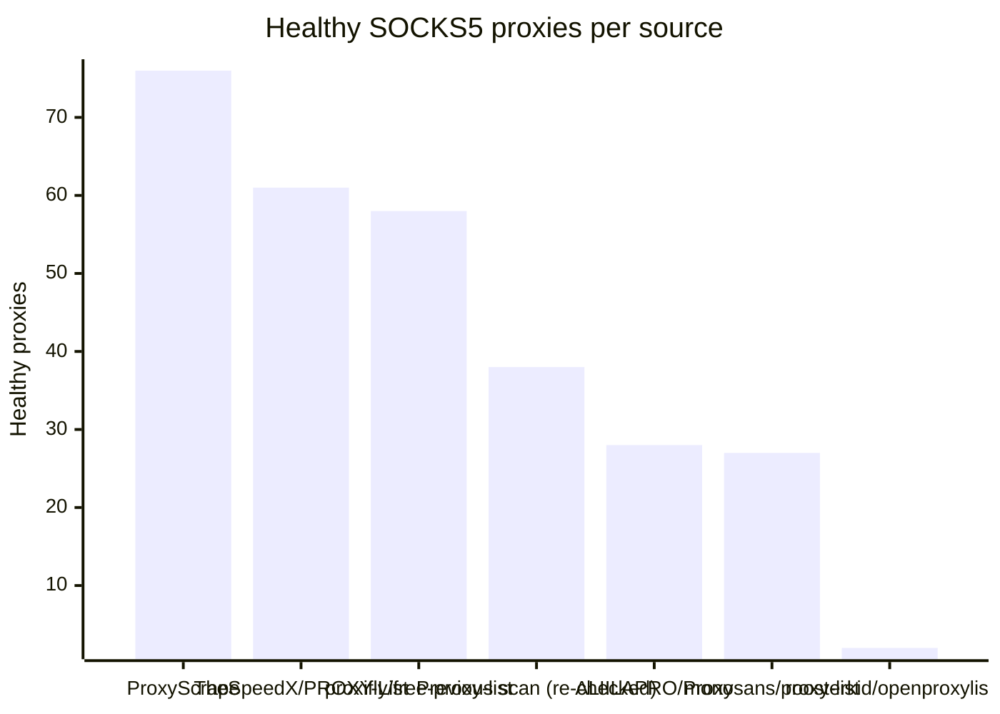

# Proxy Configs

<!-- dynamic timestamp placeholders for workflow sed script -->
channel_stats_chart.svg?v=1788030873
performance_report.html?v=1788030873

### Performance Chart

### Performance Report
[View Report](assets/performance_report.html?v=1788030873)

## HTTP

<!-- STATS:HTTP:START -->

_Last updated: 2026-09-05 12:06 UTC_

| Source | Healthy proxies |
|---|---|
| monosans/proxy-list | 64 |
| Previous scan (re-checked) | 46 |
| ProxyScrape | 44 |
| TheSpeedX/PROXY-List | 42 |
| ALIILAPRO/Proxy | 25 |
| proxifly/free-proxy-list | 13 |
| **Total unique** | **234** |

<!-- STATS:HTTP:END -->

## SOCKS5

<!-- STATS:SOCKS5:START -->

_Last updated: 2026-09-05 12:06 UTC_

| Source | Healthy proxies |
|---|---|
| ProxyScrape | 76 |
| TheSpeedX/PROXY-List | 61 |
| proxifly/free-proxy-list | 58 |
| Previous scan (re-checked) | 38 |
| ALIILAPRO/Proxy | 28 |
| monosans/proxy-list | 27 |
| roosterkid/openproxylist | 2 |
| **Total unique** | **290** |

<!-- STATS:SOCKS5:END -->
