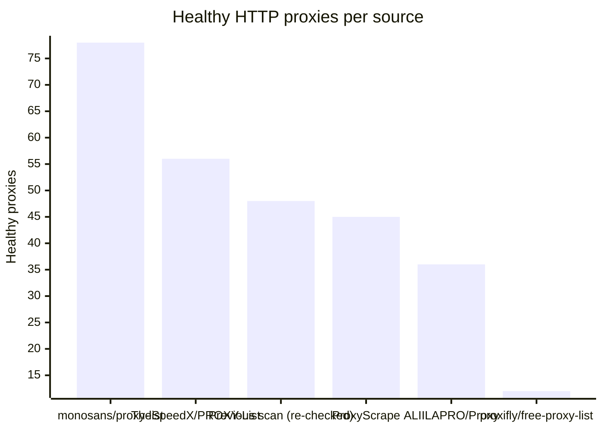
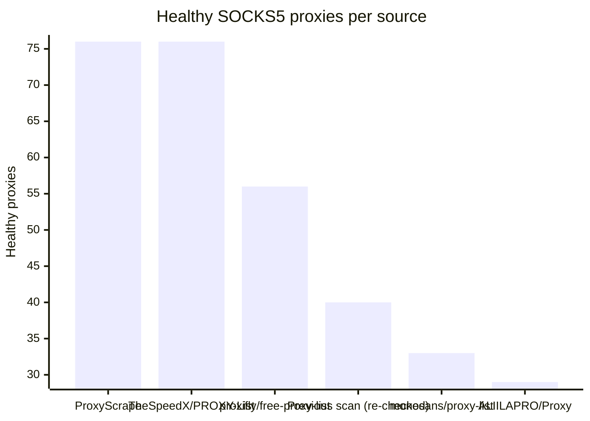

# Proxy Configs

<!-- dynamic timestamp placeholders for workflow sed script -->
channel_stats_chart.svg?v=1788501798
performance_report.html?v=1788501798

### Performance Chart

### Performance Report
[View Report](assets/performance_report.html?v=1788501798)

## HTTP

<!-- STATS:HTTP:START -->

_Last updated: 2026-09-04 00:08 UTC_

| Source | Healthy proxies |
|---|---|
| monosans/proxy-list | 78 |
| TheSpeedX/PROXY-List | 56 |
| Previous scan (re-checked) | 48 |
| ProxyScrape | 45 |
| ALIILAPRO/Proxy | 36 |
| proxifly/free-proxy-list | 12 |
| **Total unique** | **275** |

<!-- STATS:HTTP:END -->

## SOCKS5

<!-- STATS:SOCKS5:START -->

_Last updated: 2026-09-04 00:08 UTC_

| Source | Healthy proxies |
|---|---|
| ProxyScrape | 76 |
| TheSpeedX/PROXY-List | 76 |
| proxifly/free-proxy-list | 56 |
| Previous scan (re-checked) | 40 |
| monosans/proxy-list | 33 |
| ALIILAPRO/Proxy | 29 |
| **Total unique** | **310** |

<!-- STATS:SOCKS5:END -->
