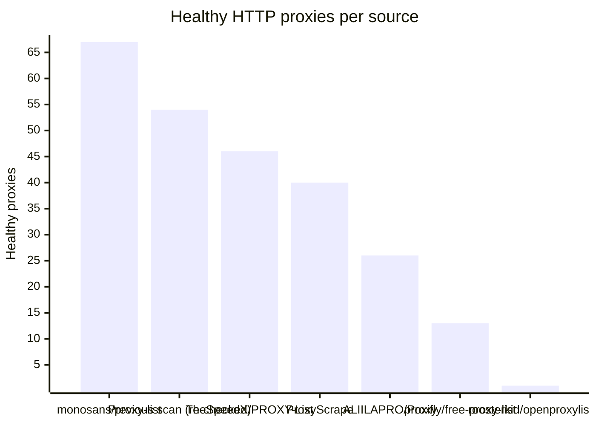
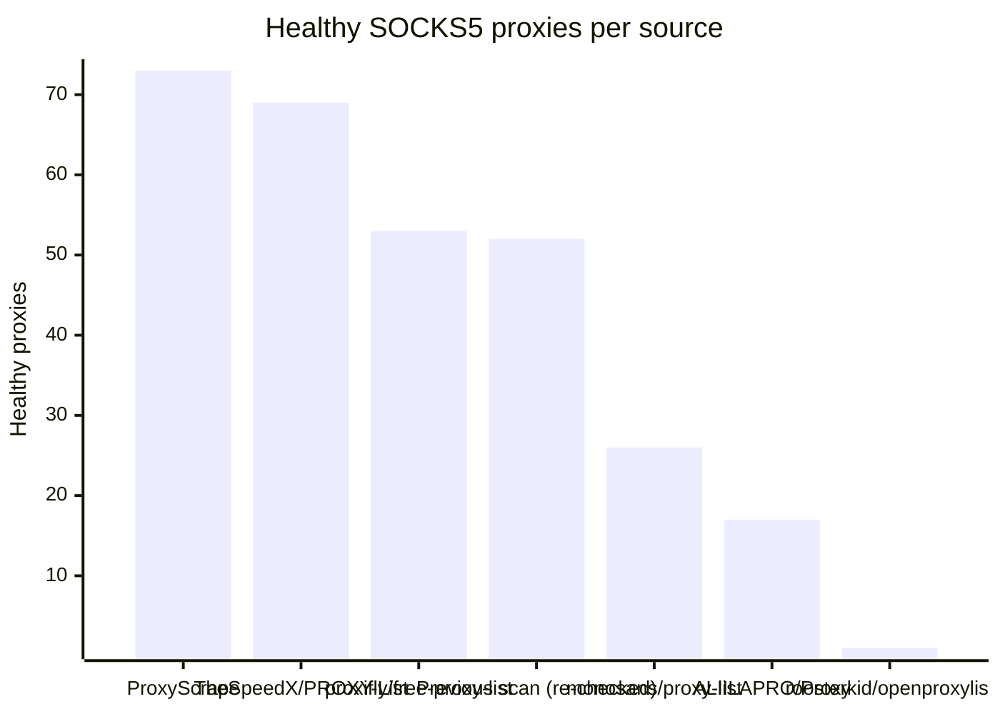

# Proxy Configs

<!-- dynamic timestamp placeholders for workflow sed script -->
channel_stats_chart.svg?v=1788804135
performance_report.html?v=1788804135

### Performance Chart

### Performance Report
[View Report](assets/performance_report.html?v=1788804135)

## HTTP

<!-- STATS:HTTP:START -->

_Last updated: 2026-09-07 12:07 UTC_

| Source | Healthy proxies |
|---|---|
| monosans/proxy-list | 67 |
| Previous scan (re-checked) | 54 |
| TheSpeedX/PROXY-List | 46 |
| ProxyScrape | 40 |
| ALIILAPRO/Proxy | 26 |
| proxifly/free-proxy-list | 13 |
| roosterkid/openproxylist | 1 |
| **Total unique** | **247** |

<!-- STATS:HTTP:END -->

## SOCKS5

<!-- STATS:SOCKS5:START -->

_Last updated: 2026-09-07 12:07 UTC_

| Source | Healthy proxies |
|---|---|
| ProxyScrape | 73 |
| TheSpeedX/PROXY-List | 69 |
| proxifly/free-proxy-list | 53 |
| Previous scan (re-checked) | 52 |
| monosans/proxy-list | 26 |
| ALIILAPRO/Proxy | 17 |
| roosterkid/openproxylist | 1 |
| **Total unique** | **291** |

<!-- STATS:SOCKS5:END -->
