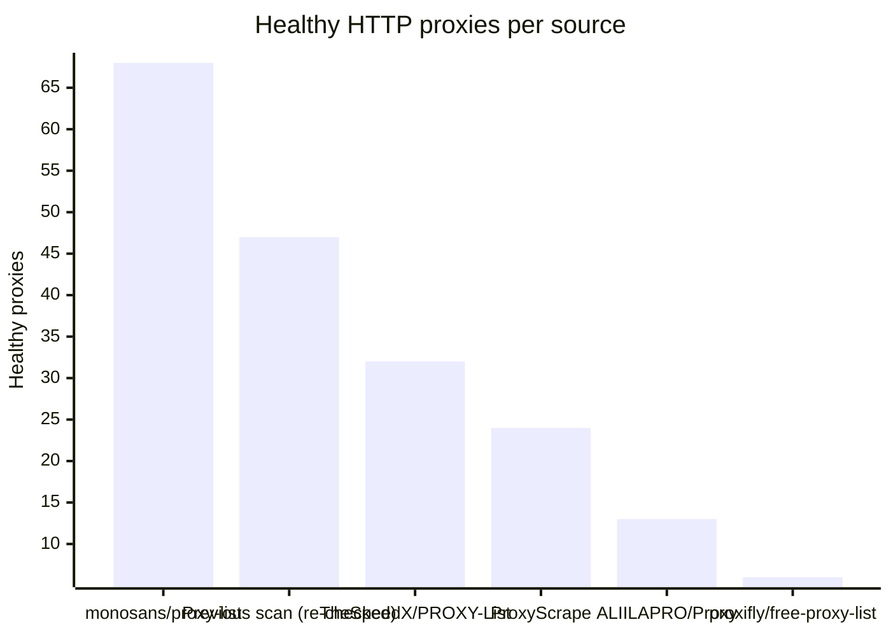
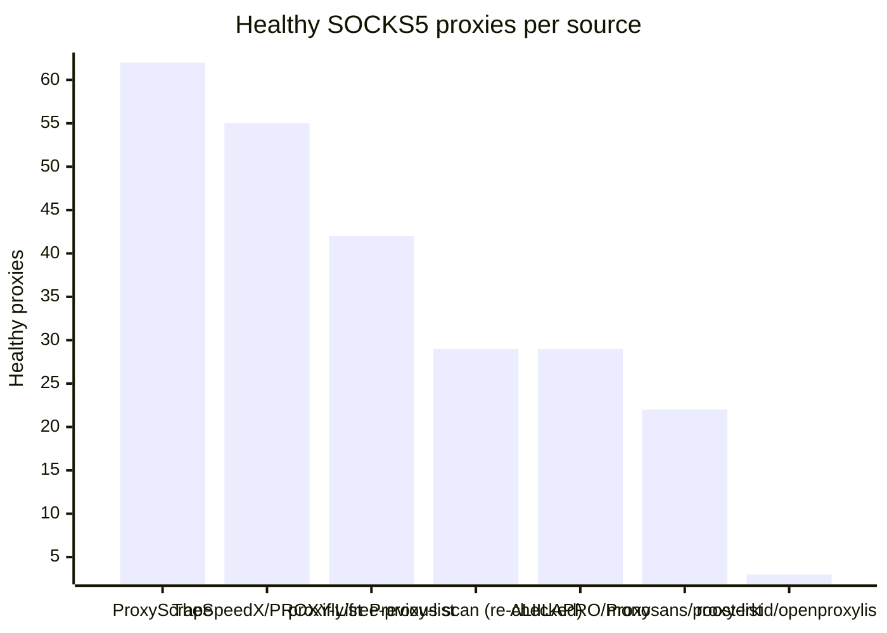

# Proxy Configs

<!-- dynamic timestamp placeholders for workflow sed script -->
channel_stats_chart.svg?v=1789149663
performance_report.html?v=1789149663

### Performance Chart

### Performance Report
[View Report](assets/performance_report.html?v=1789149663)

## HTTP

<!-- STATS:HTTP:START -->

_Last updated: 2026-09-11 12:06 UTC_

| Source | Healthy proxies |
|---|---|
| monosans/proxy-list | 68 |
| Previous scan (re-checked) | 47 |
| TheSpeedX/PROXY-List | 32 |
| ProxyScrape | 24 |
| ALIILAPRO/Proxy | 13 |
| proxifly/free-proxy-list | 6 |
| **Total unique** | **190** |

<!-- STATS:HTTP:END -->

## SOCKS5

<!-- STATS:SOCKS5:START -->

_Last updated: 2026-09-11 12:06 UTC_

| Source | Healthy proxies |
|---|---|
| ProxyScrape | 62 |
| TheSpeedX/PROXY-List | 55 |
| proxifly/free-proxy-list | 42 |
| Previous scan (re-checked) | 29 |
| ALIILAPRO/Proxy | 29 |
| monosans/proxy-list | 22 |
| roosterkid/openproxylist | 3 |
| **Total unique** | **242** |

<!-- STATS:SOCKS5:END -->
