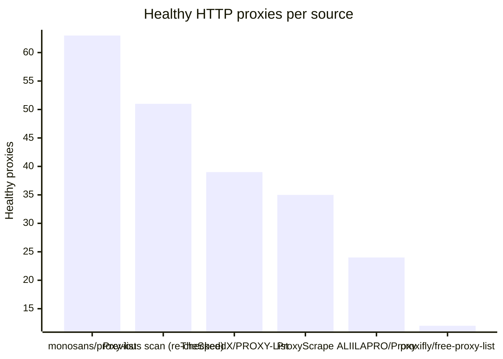
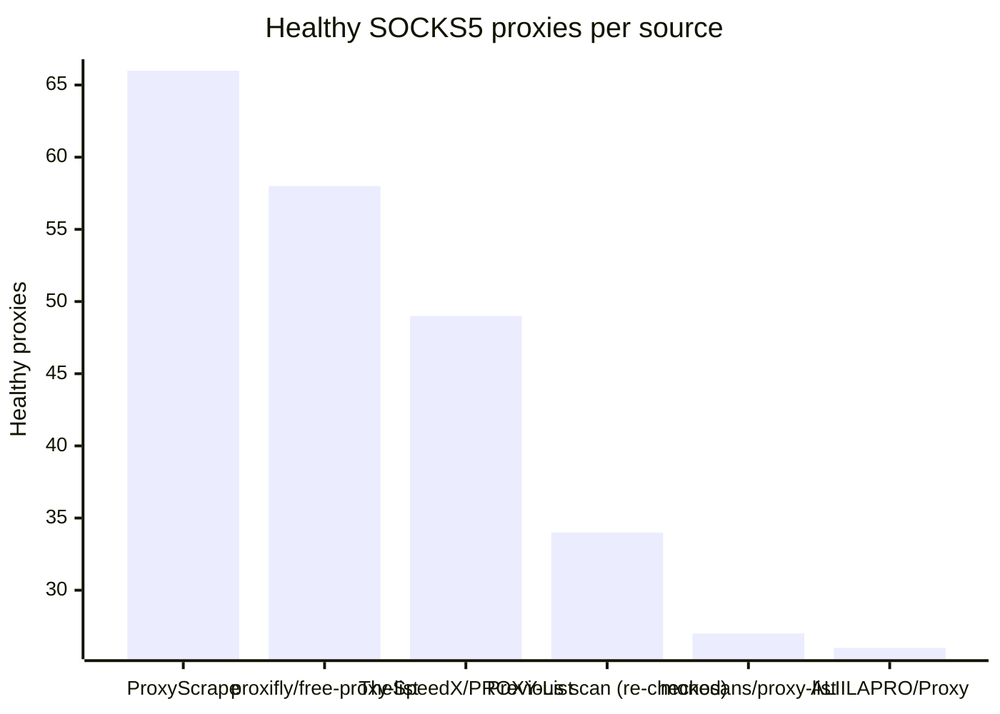

# Proxy Configs

<!-- dynamic timestamp placeholders for workflow sed script -->
channel_stats_chart.svg?v=1788328879
performance_report.html?v=1788328879

### Performance Chart

### Performance Report
[View Report](assets/performance_report.html?v=1788328879)

## HTTP

<!-- STATS:HTTP:START -->

_Last updated: 2026-09-02 00:06 UTC_

| Source | Healthy proxies |
|---|---|
| monosans/proxy-list | 63 |
| Previous scan (re-checked) | 51 |
| TheSpeedX/PROXY-List | 39 |
| ProxyScrape | 35 |
| ALIILAPRO/Proxy | 24 |
| proxifly/free-proxy-list | 12 |
| **Total unique** | **224** |

<!-- STATS:HTTP:END -->

## SOCKS5

<!-- STATS:SOCKS5:START -->

_Last updated: 2026-09-02 00:06 UTC_

| Source | Healthy proxies |
|---|---|
| ProxyScrape | 66 |
| proxifly/free-proxy-list | 58 |
| TheSpeedX/PROXY-List | 49 |
| Previous scan (re-checked) | 34 |
| monosans/proxy-list | 27 |
| ALIILAPRO/Proxy | 26 |
| **Total unique** | **260** |

<!-- STATS:SOCKS5:END -->
