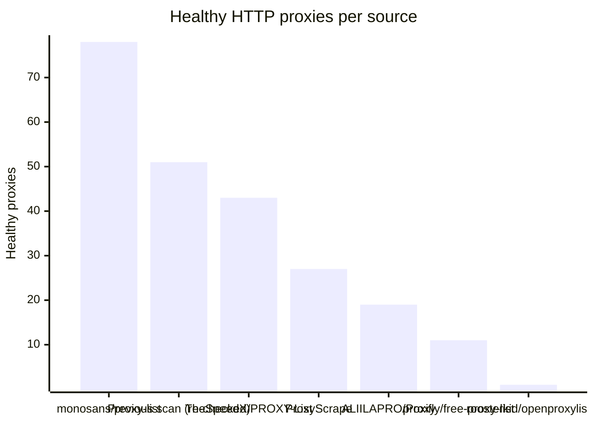
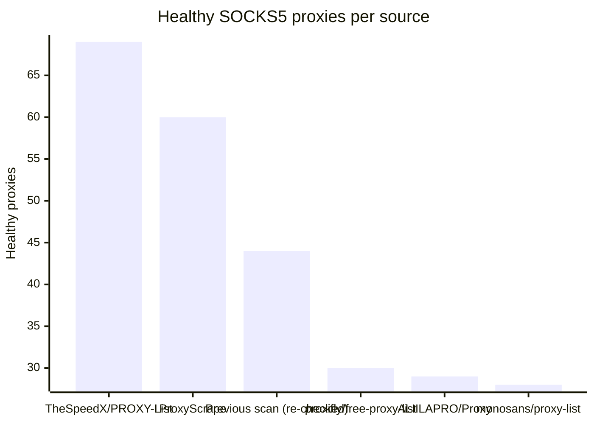

# Proxy Configs

<!-- dynamic timestamp placeholders for workflow sed script -->
channel_stats_chart.svg?v=1788033769
performance_report.html?v=1788033769

### Performance Chart

### Performance Report
[View Report](assets/performance_report.html?v=1788033769)

## HTTP

<!-- STATS:HTTP:START -->

_Last updated: 2026-08-29 19:36 UTC_

| Source | Healthy proxies |
|---|---|
| monosans/proxy-list | 78 |
| Previous scan (re-checked) | 51 |
| TheSpeedX/PROXY-List | 43 |
| ProxyScrape | 27 |
| ALIILAPRO/Proxy | 19 |
| proxifly/free-proxy-list | 11 |
| roosterkid/openproxylist | 1 |
| **Total unique** | **230** |

<!-- STATS:HTTP:END -->

## SOCKS5

<!-- STATS:SOCKS5:START -->

_Last updated: 2026-08-29 19:36 UTC_

| Source | Healthy proxies |
|---|---|
| TheSpeedX/PROXY-List | 69 |
| ProxyScrape | 60 |
| Previous scan (re-checked) | 44 |
| proxifly/free-proxy-list | 30 |
| ALIILAPRO/Proxy | 29 |
| monosans/proxy-list | 28 |
| **Total unique** | **260** |

<!-- STATS:SOCKS5:END -->
