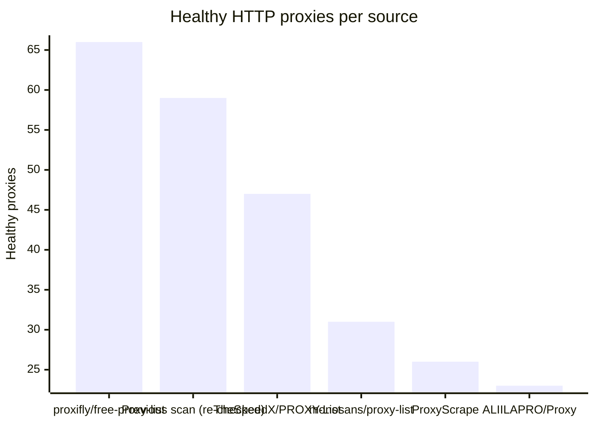
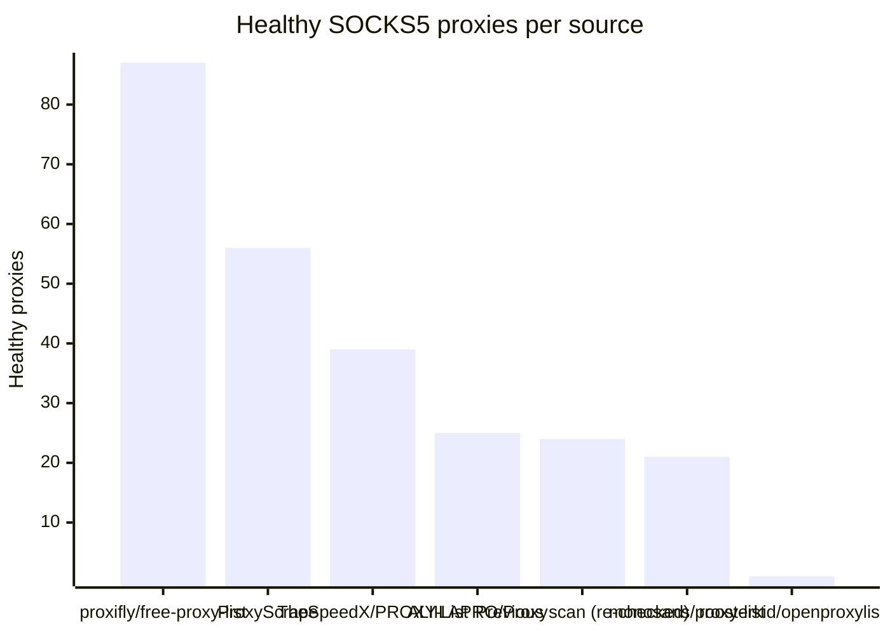

# Proxy Configs

<!-- dynamic timestamp placeholders for workflow sed script -->
channel_stats_chart.svg?v=1790618506
performance_report.html?v=1790618506

### Performance Chart

### Performance Report
[View Report](assets/performance_report.html?v=1790618506)

## HTTP

<!-- STATS:HTTP:START -->

_Last updated: 2026-09-28 12:19 UTC_

```mermaid
xychart-beta
    title "Healthy HTTP proxies per source"
    x-axis ["proxifly/free-proxy-list", "Previous scan (re-checked)", "TheSpeedX/PROXY-List", "monosans/proxy-list", "ProxyScrape", "ALIILAPRO/Proxy"]
    y-axis "Healthy proxies"
    bar [66, 59, 47, 31, 26, 23]
```

| Source | Healthy proxies |
|---|---|
| proxifly/free-proxy-list | 66 |
| Previous scan (re-checked) | 59 |
| TheSpeedX/PROXY-List | 47 |
| monosans/proxy-list | 31 |
| ProxyScrape | 26 |
| ALIILAPRO/Proxy | 23 |
| **Total unique** | **252** |

<!-- STATS:HTTP:END -->

## SOCKS5

<!-- STATS:SOCKS5:START -->

_Last updated: 2026-09-28 12:19 UTC_

```mermaid
xychart-beta
    title "Healthy SOCKS5 proxies per source"
    x-axis ["proxifly/free-proxy-list", "ProxyScrape", "TheSpeedX/PROXY-List", "ALIILAPRO/Proxy", "Previous scan (re-checked)", "monosans/proxy-list", "roosterkid/openproxylist"]
    y-axis "Healthy proxies"
    bar [87, 56, 39, 25, 24, 21, 1]
```

| Source | Healthy proxies |
|---|---|
| proxifly/free-proxy-list | 87 |
| ProxyScrape | 56 |
| TheSpeedX/PROXY-List | 39 |
| ALIILAPRO/Proxy | 25 |
| Previous scan (re-checked) | 24 |
| monosans/proxy-list | 21 |
| roosterkid/openproxylist | 1 |
| **Total unique** | **253** |

<!-- STATS:SOCKS5:END -->
